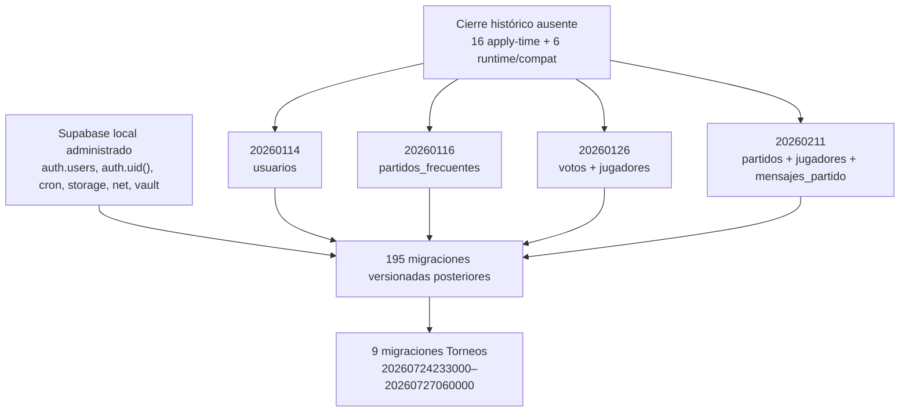

# Baseline reproducible del esquema histórico

Estado: **bloqueada; no se creó SQL de baseline**.

Fecha de auditoría: 2026-07-27.

## Alcance y garantías

Esta intervención partió de `origin/epic/arma2-torneos` en
`95b90243ad5cb430ae8fa2b25bc849a02242deed` y se ejecutó en el worktree
independiente `/Users/nicoavayu/Downloads/arma2/arma2-schema-baseline`, rama
`feature/reproducible-schema-baseline`.

No se consultó ni modificó producción, no se usaron credenciales productivas,
no se ejecutaron `supabase link`, `supabase db push`, comandos remotos de
Supabase ni migraciones remotas. `main`, la epic y el PR #103 no se
modificaron ni mergearon. Tampoco se tocaron Auth funcional, PostgREST,
Storage funcional, frontend autenticado, Estudio Social, Multimedia Upload,
iOS, Android, Capacitor, versiones ni stores.

Referencias confirmadas después de `git fetch origin`:

| Referencia | SHA |
| --- | --- |
| Base `origin/epic/arma2-torneos` | `95b90243ad5cb430ae8fa2b25bc849a02242deed` |
| `origin/main` | `cd646a3dcf726f82a44ed0f163f9985fc05d5711` |
| PR #103 / `feature/torneos-staging-readiness` | `c30b63ac352755c7e04f0c4ab6de6a6d36799828` |

## Por qué faltaba la baseline

`supabase/migrations/README.md` declara `supabase/migrations` como fuente
canónica. Su primer archivo versionado es
`20260114_add_avatar_encuadre.sql`, que ejecuta `ALTER TABLE
public.usuarios`. Ningún archivo versionado anterior crea la tabla y ninguna
migración versionada posterior puede satisfacer una dependencia que debe
existir antes del primer `ALTER`.

La secuencia falla además aunque se supliera sólo `usuarios`:

1. `20260114_add_avatar_encuadre.sql` requiere `public.usuarios`.
2. `20260116_add_precio_cancha_por_persona.sql` requiere
   `public.partidos_frecuentes`.
3. `20260126_reset_votacion.sql` define una función cuya ejecución requiere
   `public.votos` (`partido_id`) y `public.jugadores` (`partido_id`, `score`).
4. `20260211_chat_send_message_rpc.sql` define una función que usa
   `public.partidos`, `public.jugadores` y `public.mensajes_partido`.
5. Las siguientes migraciones agregan dependencias sobre `profiles`,
   `notification_delivery_log`, `notifications`, `survey_results` y otras
   relaciones heredadas.

## Qué cuenta realmente como migración

El guard actual informa 204 archivos porque cuenta todo `*.sql`. El
inventario distingue:

- **199 archivos versionados**, ordenados lexicográficamente por el prefijo
  numérico, desde `20260114` hasta `20260727060000`;
- **5 scripts sin versión**, que no cumplen
  `<timestamp>_<description>.sql` y por lo tanto no tienen posición
  certificable en el historial:
  `add_surveys_sent_column.sql`,
  `cleanup_early_survey_notifications.sql`,
  `fanout_survey_start_notifications.sql`,
  `fix_incomplete_survey_notifications.sql` y
  `setup_notifications_read_and_survey_constraints.sql`.

Los cinco scripts sin versión también presuponen objetos heredados y uno
contiene `DELETE`; no son una baseline y no se incorporaron artificialmente a
la secuencia.

La CLI instalada es `2.84.2`. `supabase migration list --local` se intentó sin
arrancar servicios y terminó de forma segura con `connection refused` en
`127.0.0.1:54322`. No se ejecutó `supabase start`: al quedar en el escenario B
no corresponde iniciar Auth/PostgREST/Storage ni certificar una baseline que
no existe.

## Grafo de dependencias



Las dependencias administradas por Supabase detectadas son `auth.uid`,
`auth.users`, `cron.job`, `cron.job_run_details`, `storage.buckets`,
`storage.objects`, `net.http_post`, `vault.decrypted_secrets` y
`cron.schedule`. No deben recrearse en una baseline de aplicación.

De las 22 relaciones `public` ausentes del historial versionado, 16 son
necesarias durante la aplicación limpia de las migraciones: `usuarios`,
`partidos_frecuentes`, `partidos`, `notifications`, `survey_results`,
`guest_match_invites`, `jugadores`, `mensajes_partido`, `votos`,
`votos_publicos`, `player_awards`, `post_match_surveys`, `amigos`,
`partidos_manuales`, `match_join_requests` y `public_voters`. Las otras seis
son dependencias de ejecución o compatibilidad: `profiles`,
`notification_delivery_log`, `partido_team_confirmations`,
`notifications_ext`, `partidos_view` y `survey_progress`. Las dos vistas se
tocan con `ALTER VIEW IF EXISTS`; su ausencia no detiene el reset, pero el
repositorio tampoco permite certificar si deberían existir ni con qué ACL.

Las extensiones declaradas por las migraciones versionadas son `pgcrypto`,
`pg_cron`, `pg_net`, `vault` y `btree_gist`. No se encontró ningún `CREATE
TYPE`; el historial versionado no define enums de aplicación.

## Objetos históricos faltantes

La columna “Usado por” cuenta archivos versionados que hacen referencia a la
relación. Una fuente “media” puede describir un objeto aislado, pero no
demuestra que esa definición, sus ACL y sus políticas sean el estado
pre-`20260114`. Las fuentes “bajas” sólo evidencian columnas consumidas.

| Objeto | Primera dependencia | Fuente encontrada | Confianza | Conflictos o faltantes | Usado por |
| --- | --- | --- | ---: | --- | ---: |
| `public.usuarios` | `20260114` | Harnesses embebidos, clientes, RPC de sync y scripts `ALTER` | Baja | No existe `CREATE` canónico. Desconocidos PK/FK, nullability, defaults, checks, índices, RLS, policies y ACL. Los harnesses declaran ser stubs mínimos. | 52 |
| `public.partidos_frecuentes` | `20260116` | Clientes, scripts `ALTER` y stub de Quiero Jugar | Baja | No existe definición completa. `id`, PK/FK, columnas históricas, RLS y ACL no están cerrados. | 2 |
| `public.jugadores` | `20260126` | Harnesses mínimos, scripts de reparación y documentación | Baja | `id` aparece como bigint en algunos stubs y se usa también `uuid`; no hay definición completa ni contrato de RLS/ACL. | 86 |
| `public.votos` | `20260126` | Documentación y scripts de reparación/policies | Baja | No existe `CREATE` canónico. Identidad del votante, tipos de FK, unique/checks, RLS y ACL son ambiguos. | 7 |
| `public.mensajes_partido` | `20260211` | `scripts/db-integration/stub-schema.sql` | Baja | El propio archivo dice que reproduce sólo columnas tocadas por el test. No prueba PK/FK, nullability, RLS ni grants históricos. | 3 |
| `public.partidos` | `20260211` | Harnesses, clientes, documentación y muchos `ALTER` | Baja | No existe bootstrap completo. Se desconocen forma inicial, constraints, índices, triggers, RLS y ACL. | 75 |
| `public.profiles` | `20260212000000` | Harnesses con tres columnas y clientes | Baja | No existe migración de creación; posible solapamiento con `usuarios`; seguridad desconocida. | 7 |
| `public.notification_delivery_log` | `20260212033000` | `migrations/20260206_notification_system.sql`; stub | Media | El archivo está en el archivo legacy, no en la fuente canónica. Migraciones posteriores esperan evolución adicional; ACL final no demostrada. | 3 |
| `public.notifications` | `20260212033000` | Varias migraciones legacy y harnesses | Baja | FK a `auth.users` versus `public.usuarios`; `id` UUID versus bigint; `updated_at` opcional; policies incompatibles e inserciones con `WITH CHECK (true)`. | 66 |
| `public.survey_results` | `20260212035000` | `migrations/legacy/survey_results_table.sql` | Media | La definición exige `ready_at NOT NULL` sin default, incompatible con inserts posteriores que no lo proveen; faltan evoluciones/ACL verificadas. | 9 |
| `public.partido_team_confirmations` | `20260218123000` | `migrations/20260210_templates_teams_winner.sql` | Media | Definición aislada en archivo legacy; depende de tablas base desconocidas y no demuestra estado/ACL a `20260114`. | 3 |
| `public.guest_match_invites` | `20260221170000` | `migrations/20260210_guest_invite_tokens.sql` | Media | Definición aislada fuera de la fuente canónica; no hay prueba de aplicación ni de ACL finales. | 2 |
| `public.votos_publicos` | `20260224013000` | Clientes y scripts de reparación | Baja | No se encontró `CREATE TABLE`; tipos, claves, RLS, policies y grants desconocidos. | 7 |
| `public.notifications_ext` | `20260224193000` | Dos vistas legacy casi equivalentes | Media | Depende de la forma ambigua de `notifications`; no demuestra cuál fue aplicada ni su ACL final. | 1 |
| `public.partidos_view` | `20260224193000` | Clientes y scripts de inspección | Baja | No se encontró `CREATE VIEW`; definición, `security_invoker` y ACL desconocidos. | 1 |
| `public.player_awards` | `20260227153000` | Cuatro definiciones legacy | Baja | `SERIAL` versus `BIGSERIAL`, `INTEGER` versus `BIGINT`, `otorgado_por` presente/eliminado, FK y unique presentes/ausentes; policies incompatibles. | 3 |
| `public.post_match_surveys` | `20260310183000` | Clientes, docs y scripts `ALTER` | Baja | No se encontró `CREATE TABLE`; identidad, constraints, índices, RLS y ACL desconocidos. | 6 |
| `public.survey_progress` | `20260310183000` | `migrations/20260206_notification_system.sql` | Media | Archivo legacy aislado, sin evidencia de aplicación ni cierre de grants/policies. | 1 |
| `public.amigos` | `20260313220000` | Tres definiciones legacy | Baja | FK a `auth.users` versus `public.usuarios`; defaults/nullability distintos; policies de update diferentes; grants finales desconocidos. | 1 |
| `public.public_voters` | `20260315194000` | Clientes y scripts RPC | Baja | No se encontró `CREATE TABLE`; normalización, uniqueness, RLS y acceso anon son desconocidos. | 5 |
| `public.partidos_manuales` | `20260316233000` | `migrations/legacy/create_manual_matches_and_injuries_tables.sql` | Media | Definición aislada; no demuestra evolución, grants ni estado pre-primera-migración. | 1 |
| `public.match_join_requests` | `20260320193000` | Tres migraciones legacy incompatibles | Baja | `id` UUID versus identity bigint; `partido_id/usuario_id/estado`, `match_id/user_id/status` y `requester_user_id` compiten; índices y policies divergen. | 10 |

Las secuencias identity/serial derivadas de tablas creadas más tarde no se
consideran objetos históricos independientes. Sí deben quedar determinadas
por la definición canónica de cada tabla.

## Fuentes inspeccionadas

Se inspeccionaron:

- los 204 SQL de `supabase/migrations`, los 31 SQL del archivo `migrations/`,
  `migrations/legacy`, `db/migrations`, `src/db`, `sql` y scripts SQL;
- `supabase/config.toml`, seeds inexistentes, funciones Edge y configuración
  de Storage;
- harnesses embedded-postgres, en especial
  `scripts/db-integration/stub-schema.sql` y los harnesses de Torneos,
  goalkeepers, rejoin y Quiero Jugar;
- clientes Supabase, RPCs, tests, documentación legacy, parches y diffs;
- todo el historial y todas las ramas accesibles con `git log --all`,
  búsquedas pickaxe `-S`/`-G`, `git rev-list --objects --all` y archivos
  eliminados;
- posibles dumps, backups, `schema.sql`, bootstraps y tipos generados.

No hay tags. No se encontró dump schema-only, `schema.sql`, bootstrap completo
ni tipos generados de Supabase. El historial sólo contiene un SQL eliminado,
`migrations/20260213_guest_phone_unique_guard.sql`, que no es una baseline. Las
nueve apariciones históricas de `CREATE TABLE public.usuarios` provienen de
harnesses de prueba incorporados entre julio de 2026; ninguna es una
migración histórica.

### Clasificación de evidencia

| Fuente | Confianza | Motivo |
| --- | ---: | --- |
| Dump schema-only histórico | No encontrada | Habría sido evidencia alta. |
| Migración/bootstrap completo recuperable | No encontrado | No existe cierre anterior a `20260114`. |
| Migraciones SQL del archivo root/legacy | Media por objeto, insuficiente globalmente | Algunas crean objetos aislados; no forman una secuencia única y se contradicen. |
| Harnesses embedded-postgres | Media para el test, baja para baseline | Declaran explícitamente ser stubs mínimos “prod-faithful” sólo en la forma consumida. |
| Tipos generados | No encontrados | No pueden resolver nullability/defaults/ACL. |
| Clientes, tests y documentación | Baja | Prueban nombres usados, no el contrato completo. |

## Campos y seguridad que siguen ambiguos

Aunque los usos permiten inferir nombres de columnas, no permiten reconstruir
sin ambigüedad:

- tipos exactos de identificadores históricos y compatibilidad bigint/UUID;
- nullability y defaults iniciales;
- PK, FK y acciones `ON DELETE`/`ON UPDATE`;
- uniques parciales, checks e índices;
- funciones y triggers preexistentes no versionados;
- RLS habilitado/forzado y el conjunto final de policies;
- grants/revokes a `PUBLIC`, `anon`, `authenticated` y `service_role`;
- publicación Realtime y seguridad de vistas;
- extensiones instaladas antes del historial.

Adoptar las policies legacy tampoco sería seguro: hay ejemplos con
`USING (true)`, `WITH CHECK (true)`, `auth.role()` y grants a `anon` que no
pueden promoverse a contrato canónico sin saber cuál estado fue realmente
aplicado.

## Decisión

Aplica el **escenario B**. El repositorio no contiene evidencia canónica
suficiente para reconstruir tablas, columnas, tipos, defaults, constraints,
índices, funciones, triggers, RLS, policies, grants, revokes y extensiones del
estado inmediatamente anterior a `20260114`.

Por lo tanto:

- no se creó `<version-anterior>_legacy_schema_baseline.sql`;
- no se editó ninguna migración histórica;
- no se ejecutaron resets ni las 199 migraciones versionadas;
- no se abrió el recorrido funcional de Torneos;
- la promoción de #103 sigue bloqueada hasta obtener evidencia schema-only.

## Evidencia requerida y comando futuro

Se requiere autorización explícita posterior para una única lectura
schema-only de producción. La credencial debe ser una URI PostgreSQL temporal
para un rol `schema_auditor` con expiración corta, `LOGIN`, `CONNECT` a la base
y visibilidad/lectura de catálogo y objetos de `public`, sin `SUPERUSER`,
`CREATEDB`, `CREATEROLE`, `BYPASSRLS`, pertenencia a `service_role` ni acceso a
datos fuera de lo estrictamente necesario. No sirve una anon key ni una
service-role key de la API.

Comando propuesto, **no ejecutado**:

```bash
export ARMA2_SCHEMA_AUDIT_DB_URL='postgresql://schema_auditor:<one-time-password>@<direct-db-host>:5432/postgres?sslmode=require'
PGOPTIONS='-c default_transaction_read_only=on -c statement_timeout=120000' \
  pg_dump \
  --dbname="$ARMA2_SCHEMA_AUDIT_DB_URL" \
  --schema-only \
  --schema=public \
  --no-owner \
  --quote-all-identifiers \
  --lock-wait-timeout=5s \
  --file=arma2-production-public-schema.sql
```

No se debe añadir `--no-privileges`: los ACL/grants son parte de la evidencia.
El archivo debe revisarse y redactarse antes de entrar al repositorio; no debe
contener URLs, credenciales, owners productivos ni datos. Si el dump público
referencia objetos app-owned fuera de `public`, se solicitará una segunda
lectura explícitamente acotada, no un dump indiscriminado de `auth` o
`storage`.

## Reset, rollback y gate de staging

No existe procedimiento de reset certificable todavía. Cuando haya evidencia
canónica y una baseline revisada, el gate será:

1. confirmar por CLI que la baseline se ordena antes de `20260114`;
2. ejecutar desde cero `supabase stop --no-backup`, `supabase start`,
   `supabase db reset --local` y `supabase migration list --local`;
3. repetir el reset completo tres veces;
4. ejecutar tests DB/Torneos, CI, lint, guard de migraciones, secret scan,
   health local de Auth/PostgREST/Storage y verificaciones de build/lockfile;
5. auditar RLS, grants mínimos y toda función `SECURITY DEFINER`.

Rollback de esta intervención: revertir únicamente el commit documental. No
hay SQL, esquema, datos ni infraestructura que revertir.

La relación con PR #103 es de gate: #103 conserva su certificación PostgreSQL
embebida, pero no puede declarar reproducibilidad Supabase local ni avanzar a
staging/producción hasta cerrar esta baseline. Este documento no modifica
#103.

## Inventario por migración

La tabla siguiente fue derivada del AST PostgreSQL de cada archivo versionado,
incluidas las sentencias SQL dentro de cuerpos PL/pgSQL, y complementada para
DDL dinámico en bloques `DO`. “Columnas asumidas” lista referencias directas
resolubles a una tabla; variables PL/pgSQL y nombres de CTE se excluyen. Una
dependencia versionada indica que el objeto fue creado por un archivo anterior;
un guion no implica independencia: puede depender de uno de los 22 objetos
históricos enumerados arriba.

| Versión | Archivo | Tablas asumidas | Columnas asumidas | Tipos/funciones asumidos | Triggers/policies asumidos | Extensiones | Dependencias versionadas |
| --- | --- | --- | --- | --- | --- | --- | --- |
| `20260114` | `20260114_add_avatar_encuadre.sql` | `public.usuarios` | — | — | — | — | — |
| `20260116` | `20260116_add_precio_cancha_por_persona.sql` | `public.partidos_frecuentes` | — | — | — | — | — |
| `20260126` | `20260126_reset_votacion.sql` | `public.jugadores`, `public.votos` | `public.jugadores.score` | — | — | — | — |
| `20260211` | `20260211_chat_send_message_rpc.sql` | `public.jugadores`, `public.mensajes_partido`, `public.partidos` | `public.jugadores.partido_id`, `public.jugadores.usuario_id`, `public.mensajes_partido.autor`, `public.mensajes_partido.mensaje`, `public.mensajes_partido.partido_id`, `public.partidos.creado_por`, `public.partidos.id` | — | — | — | — |
| `20260212000000` | `20260212000000_invites_magic_link_flow.sql` | `public.jugadores`, `public.partidos`, `public.profiles`, `public.usuarios` | `public.jugadores.avatar_url`, `public.jugadores.is_goalkeeper`, `public.jugadores.nombre`, `public.jugadores.partido_id`, `public.jugadores.score`, `public.jugadores.usuario_id`, `public.partidos.creado_por`, `public.partidos.fecha` (+10) | `fn:auth.uid` | — | `pgcrypto` | — |
| `20260212020500` | `20260212020500_sync_auth_users_to_usuarios.sql` | `auth.users`, `public.usuarios` | `auth.users.email`, `auth.users.id`, `auth.users.raw_user_meta_data`, `public.usuarios.acepta_invitaciones`, `public.usuarios.avatar_url`, `public.usuarios.email`, `public.usuarios.id`, `public.usuarios.nombre` (+6) | — | — | — | — |
| `20260212033000` | `20260212033000_fix_notification_delivery_log_user_fk.sql` | `auth.users`, `public.jugadores`, `public.notification_delivery_log`, `public.notifications`, `public.partidos` | `auth.users.id`, `public.notification_delivery_log.channel`, `public.notification_delivery_log.correlation_id`, `public.notification_delivery_log.error_text`, `public.notification_delivery_log.notification_delivery_log_user_id_fkey`, `public.notification_delivery_log.notification_type`, `public.notification_delivery_log.partido_id`, `public.notification_delivery_log.payload_json` (+9) | — | — | — | — |
| `20260212034000` | `20260212034000_backend_survey_scheduler.sql` | `public.notifications`, `public.partidos` | `public.notifications.partido_id`, `public.notifications.type`, `public.partidos.estado`, `public.partidos.fecha`, `public.partidos.hora`, `public.partidos.id`, `public.partidos.nombre` | — | — | — | — |
| `20260212035000` | `20260212035000_match_history_snapshots.sql` | `public.survey_results` | — | — | — | — | — |
| `20260212150000` | `20260212150000_scheduler_health_check.sql` | `cron.job`, `cron.job_run_details`, `public.notifications`, `public.partidos` | `cron.job.active`, `cron.job.jobid`, `cron.job.jobname`, `cron.job.schedule`, `cron.job_run_details.end_time`, `cron.job_run_details.jobid`, `cron.job_run_details.start_time`, `cron.job_run_details.status` (+9) | — | — | — | — |
| `20260215113000` | `20260215113000_armados_push_channels_and_reminder_scheduler.sql` | `public.jugadores`, `public.notification_delivery_log`, `public.notifications`, `public.partidos`, `public.usuarios` | `public.jugadores.partido_id`, `public.jugadores.usuario_id`, `public.notification_delivery_log.channel`, `public.notification_delivery_log.correlation_id`, `public.notification_delivery_log.created_at`, `public.notification_delivery_log.error_text`, `public.notification_delivery_log.id`, `public.notification_delivery_log.notification_type` (+18) | — | — | — | — |
| `20260216183000` | `20260216183000_add_pierna_habil_and_nivel_to_usuarios.sql` | `public.usuarios` | — | — | — | — | — |
| `20260217103000` | `20260217103000_cleanup_invalid_user_coordinates.sql` | `public.usuarios` | `public.usuarios.latitud`, `public.usuarios.longitud` | — | — | — | — |
| `20260218123000` | `20260218123000_survey_final_teams_adjustment.sql` | `auth.users`, `public.jugadores`, `public.partido_team_confirmations`, `public.partidos`, `public.survey_results` | `public.jugadores.partido_id`, `public.jugadores.usuario_id`, `public.partido_team_confirmations.partido_id`, `public.partido_team_confirmations.team_a`, `public.partido_team_confirmations.team_b`, `public.partidos.creado_por`, `public.partidos.id`, `public.survey_results.partido_id` (+1) | — | — | — | — |
| `20260219152000` | `20260219152000_no_show_penalties_tables.sql` | `public.partidos`, `public.rating_adjustments_id_seq`, `public.usuarios` | — | — | — | — | — |
| `20260219193000` | `20260219193000_push_reward_penalty_notifications.sql` | — | — | — | — | — | — |
| `20260220174500` | `20260220174500_enable_push_for_match_update.sql` | `public.jugadores`, `public.notifications`, `public.partidos` | `public.jugadores.partido_id`, `public.jugadores.usuario_id`, `public.notifications.data`, `public.notifications.message`, `public.notifications.partido_id`, `public.notifications.read`, `public.notifications.title`, `public.notifications.type` (+1) | — | — | — | — |
| `20260221153000` | `20260221153000_fix_match_update_notification_refresh_and_service_role.sql` | `public.jugadores`, `public.notification_delivery_log`, `public.notifications`, `public.partidos` | `public.jugadores.partido_id`, `public.jugadores.usuario_id`, `public.notification_delivery_log.channel`, `public.notification_delivery_log.correlation_id`, `public.notification_delivery_log.error_text`, `public.notification_delivery_log.notification_type`, `public.notification_delivery_log.partido_id`, `public.notification_delivery_log.payload_json` (+11) | `fn:public.notification_event_channel` | — | — | `20260215113000` |
| `20260221170000` | `20260221170000_guest_invite_expires_at_kickoff.sql` | `public.guest_match_invites`, `public.partidos` | `public.guest_match_invites.created_at`, `public.guest_match_invites.created_by`, `public.guest_match_invites.expires_at`, `public.guest_match_invites.id`, `public.guest_match_invites.max_uses`, `public.guest_match_invites.partido_id`, `public.guest_match_invites.revoked_at`, `public.guest_match_invites.token` (+6) | — | — | — | — |
| `20260221200000` | `20260221200000_equipos_desafios_module.sql` | `auth.users`, `storage.buckets`, `storage.objects` | `public.team_members.jugador_id`, `public.team_members.team_id`, `storage.buckets.allowed_mime_types`, `storage.buckets.file_size_limit`, `storage.buckets.id`, `storage.buckets.name`, `storage.buckets.public` | `fn:auth.uid` | — | `pgcrypto` | — |
| `20260221213000` | `20260221213000_equipos_desafios_security_hardening.sql` | `public.team_matches`, `public.teams` | `public.teams.format`, `public.teams.id` | — | — | — | `20260221200000` |
| `20260221220000` | `20260221220000_equipos_desafios_data_integrity_hardening.sql` | `public.challenges`, `public.team_matches`, `public.teams` | `public.challenges.id`, `public.challenges.status`, `public.challenges.updated_at`, `public.team_matches.challenge_id`, `public.team_matches.format`, `public.team_matches.location_name`, `public.team_matches.played_at`, `public.team_matches.score_a` (+7) | — | — | — | `20260221200000` |
| `20260221233000` | `20260221233000_team_history_grouped_rpc.sql` | — | — | — | — | — | — |
| `20260222101500` | `20260222101500_challenges_pricing_and_skill_tiers.sql` | `public.challenges`, `public.teams` | `public.challenges.challenges_field_price_non_negative_check`, `public.challenges.challenges_price_per_team_non_negative_check`, `public.challenges.challenges_skill_level_check`, `public.challenges.skill_level`, `public.teams.skill_level`, `public.teams.teams_skill_level_check` | — | — | — | `20260221200000` |
| `20260222123000` | `20260222123000_team_members_photo_url.sql` | `public.team_members` | — | — | — | — | `20260221200000` |
| `20260222184500` | `20260222184500_equipos_tiers_and_compat.sql` | `public.challenges`, `public.team_members`, `public.teams` | `public.challenges.challenges_field_price_non_negative_check`, `public.challenges.challenges_price_per_team_non_negative_check`, `public.challenges.challenges_skill_level_check`, `public.challenges.skill_level`, `public.team_members.role`, `public.team_members.team_members_role_check`, `public.teams.skill_level`, `public.teams.teams_skill_level_check` | — | — | — | `20260221200000` |
| `20260222203000` | `20260222203000_team_invitations.sql` | `auth.users`, `public.challenges`, `public.jugadores`, `public.notifications`, `public.team_members`, `public.teams`, `public.usuarios` | `auth.users.email`, `auth.users.id`, `public.challenges.accepted_by_user_id`, `public.challenges.accepted_team_id`, `public.challenges.challenger_team_id`, `public.challenges.created_by_user_id`, `public.challenges.status`, `public.jugadores.id` (+19) | `fn:auth.uid`, `fn:public.set_teams_module_updated_at` | — | `pgcrypto` | `20260221200000` |
| `20260222233000` | `20260222233000_team_chat.sql` | `public.teams`, `public.usuarios` | — | `fn:auth.uid`, `fn:public.team_user_is_member` | — | — | `20260221200000` |
| `20260223010000` | `20260223010000_challenge_match_conversion.sql` | `public.challenges`, `public.jugadores`, `public.notifications`, `public.team_matches`, `public.team_members`, `public.teams` | `public.challenges.accepted_by_user_id`, `public.challenges.accepted_team_id`, `public.challenges.challenges_cancha_cost_non_negative_check`, `public.challenges.id`, `public.challenges.status`, `public.challenges.updated_at`, `public.jugadores.id`, `public.jugadores.usuario_id` (+28) | `fn:public.set_teams_module_updated_at` | — | — | `20260221200000` |
| `20260223153000` | `20260223153000_allow_combined_challenge_formats.sql` | `public.challenges`, `public.jugadores`, `public.notifications`, `public.team_matches`, `public.team_members`, `public.teams` | `public.challenges.accepted_by_user_id`, `public.challenges.accepted_team_id`, `public.challenges.id`, `public.challenges.status`, `public.challenges.updated_at`, `public.jugadores.id`, `public.jugadores.usuario_id`, `public.notifications.created_at` (+27) | — | — | — | `20260221200000` |
| `20260223180000` | `20260223180000_allow_owner_accept_if_different_team.sql` | `public.challenges`, `public.jugadores`, `public.notifications`, `public.team_matches`, `public.team_members`, `public.teams` | `public.challenges.accepted_by_user_id`, `public.challenges.accepted_team_id`, `public.challenges.id`, `public.challenges.status`, `public.challenges.updated_at`, `public.jugadores.id`, `public.jugadores.usuario_id`, `public.notifications.created_at` (+27) | — | — | — | `20260221200000` |
| `20260223190000` | `20260223190000_harden_rpc_accept_challenge.sql` | `public.challenges`, `public.jugadores`, `public.notifications`, `public.team_matches`, `public.team_members`, `public.teams` | `public.challenges.accepted_by_user_id`, `public.challenges.accepted_team_id`, `public.challenges.id`, `public.challenges.status`, `public.challenges.updated_at`, `public.jugadores.id`, `public.jugadores.usuario_id`, `public.notifications.created_at` (+28) | — | — | — | `20260221200000` |
| `20260223193000` | `20260223193000_fix_rpc_accept_challenge_ambiguous.sql` | `public.challenges`, `public.jugadores`, `public.notifications`, `public.team_matches`, `public.team_members`, `public.teams` | `public.challenges.accepted_by_user_id`, `public.challenges.accepted_team_id`, `public.challenges.id`, `public.challenges.status`, `public.challenges.updated_at`, `public.jugadores.id`, `public.jugadores.usuario_id`, `public.notifications.created_at` (+29) | — | — | — | `20260221200000` |
| `20260223203000` | `20260223203000_add_team_mode.sql` | `public.teams` | `public.teams.teams_mode_check` | — | — | — | `20260221200000` |
| `20260223214500` | `20260223214500_team_match_rosters_rpc.sql` | `public.jugadores`, `public.team_matches`, `public.team_members` | `public.jugadores.avatar_url`, `public.jugadores.id`, `public.jugadores.nombre`, `public.jugadores.score`, `public.jugadores.usuario_id`, `public.team_matches.id`, `public.team_matches.team_a_id`, `public.team_matches.team_b_id` (+10) | — | — | — | `20260221200000` |
| `20260223224500` | `20260223224500_team_match_member_edit_and_format.sql` | `public.jugadores`, `public.team_matches`, `public.team_members` | `public.jugadores.avatar_url`, `public.jugadores.id`, `public.jugadores.nombre`, `public.jugadores.score`, `public.jugadores.usuario_id`, `public.team_matches.cancha_cost`, `public.team_matches.format`, `public.team_matches.id` (+18) | — | — | — | `20260221200000` |
| `20260224001500` | `20260224001500_challenge_header_permissions_and_chat.sql` | `public.challenges`, `public.jugadores`, `public.mensajes_partido`, `public.team_matches`, `public.team_members` | `public.challenges.created_by_user_id`, `public.challenges.id`, `public.jugadores.avatar_url`, `public.jugadores.id`, `public.jugadores.nombre`, `public.jugadores.score`, `public.jugadores.usuario_id`, `public.mensajes_partido.id` (+17) | `fn:auth.uid`, `fn:public.team_user_is_member` | — | — | `20260221200000` |
| `20260224013000` | `20260224013000_public_votes_use_1_to_10_scale.sql` | `public.votos_publicos` | `public.votos_publicos.partido_id`, `public.votos_publicos.public_voter_id`, `public.votos_publicos.puntaje`, `public.votos_publicos.votado_jugador_id`, `public.votos_publicos.votante_nombre`, `public.votos_publicos.votante_nombre_norm` | — | — | — | — |
| `20260224021000` | `20260224021000_public_votes_stable_target_identity.sql` | `public.jugadores`, `public.votos`, `public.votos_publicos` | `public.jugadores.id`, `public.jugadores.partido_id`, `public.jugadores.usuario_id`, `public.jugadores.uuid`, `public.votos.partido_id`, `public.votos.votado_id`, `public.votos_publicos.partido_id`, `public.votos_publicos.votado_jugador_id` | — | — | — | — |
| `20260224193000` | `20260224193000_fix_security_linter_views_and_rls.sql` | `public.notifications_ext`, `public.partidos_view` | — | — | — | — | — |
| `20260225021000` | `20260225021000_allow_admin_transfer_roles.sql` | `public.jugadores`, `public.teams` | `public.jugadores.id`, `public.jugadores.usuario_id`, `public.teams.id`, `public.teams.owner_user_id` | — | — | — | `20260221200000` |
| `20260225153000` | `20260225153000_survey_start_at_match_end_and_reminder_1h.sql` | `public.notifications`, `public.partidos` | `public.notifications.partido_id`, `public.notifications.type`, `public.partidos.estado`, `public.partidos.fecha`, `public.partidos.hora`, `public.partidos.id`, `public.partidos.nombre`, `public.partidos.surveys_sent` | — | — | — | — |
| `20260225190000` | `20260225190000_update_team_invite_notification_copy.sql` | `public.notifications`, `public.team_invitations`, `public.teams`, `public.usuarios` | `public.notifications.created_at`, `public.notifications.data`, `public.notifications.message`, `public.notifications.read`, `public.notifications.title`, `public.notifications.type`, `public.notifications.user_id`, `public.team_invitations.created_at` (+10) | — | — | — | `20260221200000`, `20260222203000` |
| `20260225193000` | `20260225193000_allow_invited_users_read_team_rows.sql` | `public.challenges`, `public.team_invitations`, `public.teams` | `public.challenges.accepted_by_user_id`, `public.challenges.accepted_team_id`, `public.challenges.challenger_team_id`, `public.challenges.created_by_user_id`, `public.challenges.status`, `public.team_invitations.invited_user_id`, `public.team_invitations.status`, `public.team_invitations.team_id` (+1) | `fn:auth.uid`, `fn:public.team_user_is_member` | — | — | `20260221200000`, `20260222203000` |
| `20260225210000` | `20260225210000_allow_team_member_self_leave.sql` | `public.jugadores`, `public.team_members` | `public.jugadores.id`, `public.jugadores.usuario_id`, `public.team_members.jugador_id` | `fn:auth.uid`, `fn:public.team_user_is_admin_or_owner` | — | — | `20260221200000`, `20260222203000` |
| `20260226123000` | `20260226123000_allow_authenticated_insert_notifications_for_recipients.sql` | `public.notifications` | — | — | — | — | — |
| `20260226191500` | `20260226191500_rpc_list_incoming_team_invitations.sql` | `auth.users`, `public.team_invitations`, `public.teams`, `public.usuarios` | `auth.users.email`, `auth.users.id`, `public.team_invitations.created_at`, `public.team_invitations.id`, `public.team_invitations.invited_by_user_id`, `public.team_invitations.invited_user_id`, `public.team_invitations.responded_at`, `public.team_invitations.status` (+8) | `fn:auth.uid` | — | — | `20260221200000`, `20260222203000` |
| `20260226200000` | `20260226200000_rpc_update_team_member_shirt_number.sql` | `public.jugadores`, `public.team_members` | `public.jugadores.id`, `public.jugadores.usuario_id`, `public.team_members.id`, `public.team_members.jugador_id`, `public.team_members.shirt_number`, `public.team_members.team_id`, `public.team_members.user_id` | `fn:public.team_user_is_admin_or_owner` | — | — | `20260221200000`, `20260222203000` |
| `20260226203000` | `20260226203000_rpc_transfer_team_captaincy.sql` | `public.jugadores`, `public.team_members` | `public.jugadores.id`, `public.jugadores.usuario_id`, `public.team_members.id`, `public.team_members.is_captain`, `public.team_members.jugador_id`, `public.team_members.team_id`, `public.team_members.user_id` | `fn:public.team_user_is_admin_or_owner` | — | — | `20260221200000`, `20260222203000` |
| `20260226213000` | `20260226213000_notify_team_captain_transfer.sql` | `auth.users`, `public.jugadores`, `public.notifications`, `public.team_members`, `public.teams`, `public.usuarios` | `auth.users.email`, `auth.users.id`, `public.jugadores.id`, `public.jugadores.usuario_id`, `public.notifications.created_at`, `public.notifications.data`, `public.notifications.message`, `public.notifications.read` (+12) | `fn:public.team_user_is_admin_or_owner` | — | — | `20260221200000`, `20260222203000` |
| `20260226223000` | `20260226223000_sync_team_match_status_on_confirm.sql` | `public.challenges`, `public.team_matches`, `public.teams` | `public.challenges.id`, `public.challenges.status`, `public.challenges.updated_at`, `public.team_matches.cancha_cost`, `public.team_matches.challenge_id`, `public.team_matches.format`, `public.team_matches.is_format_combined`, `public.team_matches.location` (+10) | — | — | — | `20260221200000` |
| `20260226231000` | `20260226231000_fix_team_match_chat_partido_null_cast.sql` | `public.team_matches` | `public.team_matches.id` | — | — | — | `20260221200000` |
| `20260226235500` | `20260226235500_rpc_challenge_head_to_head_stats.sql` | `public.team_matches` | `public.team_matches.challenge_id`, `public.team_matches.created_at`, `public.team_matches.id`, `public.team_matches.origin_type`, `public.team_matches.played_at`, `public.team_matches.scheduled_at`, `public.team_matches.score_a`, `public.team_matches.score_b` (+4) | — | — | — | `20260221200000` |
| `20260227102000` | `20260227102000_survey_team_lock_and_result_status.sql` | `auth.users`, `public.jugadores`, `public.partidos`, `public.survey_results` | `public.jugadores.id`, `public.jugadores.partido_id`, `public.jugadores.usuario_id`, `public.jugadores.uuid`, `public.partidos.creado_por`, `public.partidos.final_team_a`, `public.partidos.final_team_b`, `public.partidos.final_teams_updated_at` (+3) | — | — | — | — |
| `20260227153000` | `20260227153000_survey_closure_stabilization.sql` | `public.jugadores`, `public.partidos`, `public.player_awards`, `public.survey_results` | `public.jugadores.partido_id`, `public.jugadores.usuario_id`, `public.partidos.finished_at`, `public.partidos.id`, `public.partidos.result_status`, `public.partidos.winner_team`, `public.player_awards.award_type`, `public.player_awards.id` (+6) | — | — | — | — |
| `20260227170000` | `20260227170000_jugadores_unique_partido_usuario.sql` | `public.jugadores` | `public.jugadores.id`, `public.jugadores.partido_id`, `public.jugadores.usuario_id` | — | — | — | — |
| `20260302120000` | `20260302120000_allow_team_captain_manage_team.sql` | — | — | — | — | — | — |
| `20260303103000` | `20260303103000_match_invite_request_join_mode.sql` | `public.jugadores`, `public.notifications`, `public.partidos`, `public.usuarios` | `public.jugadores.partido_id`, `public.jugadores.usuario_id`, `public.notifications.data`, `public.notifications.message`, `public.notifications.partido_id`, `public.notifications.read`, `public.notifications.send_at`, `public.notifications.title` (+7) | — | — | — | — |
| `20260304103000` | `20260304103000_allow_captain_create_challenge.sql` | `public.challenges`, `public.teams` | `public.teams.format`, `public.teams.id` | `fn:auth.uid`, `fn:public.team_user_is_captain_or_owner` | — | — | `20260221200000` |
| `20260304103100` | `20260304103100_allow_survey_team_rewrites.sql` | `public.jugadores`, `public.partidos` | `public.jugadores.id`, `public.jugadores.partido_id`, `public.jugadores.usuario_id`, `public.jugadores.uuid`, `public.partidos.creado_por`, `public.partidos.final_team_a`, `public.partidos.final_team_b`, `public.partidos.final_teams_updated_at` (+9) | — | — | — | — |
| `20260304160000` | `20260304160000_add_structured_user_location_fields.sql` | `public.usuarios` | — | — | — | — | — |
| `20260304193000` | `20260304193000_allow_admin_update_challenges.sql` | `public.challenges` | — | `fn:auth.uid`, `fn:public.team_user_is_admin_or_owner` | — | — | `20260221200000`, `20260222203000` |
| `20260304210000` | `20260304210000_team_match_survey_bridge.sql` | `public.challenges`, `public.jugadores`, `public.partidos`, `public.team_matches`, `public.team_members`, `public.teams`, `public.usuarios` | `public.challenges.id`, `public.jugadores.avatar_url`, `public.jugadores.id`, `public.jugadores.is_goalkeeper`, `public.jugadores.nombre`, `public.jugadores.partido_id`, `public.jugadores.score`, `public.jugadores.usuario_id` (+24) | — | — | — | `20260221200000` |
| `20260304233000` | `20260304233000_team_match_survey_bridge_status_sync.sql` | `public.challenges`, `public.jugadores`, `public.partidos`, `public.team_matches`, `public.team_members`, `public.teams`, `public.usuarios` | `public.challenges.id`, `public.jugadores.avatar_url`, `public.jugadores.id`, `public.jugadores.is_goalkeeper`, `public.jugadores.nombre`, `public.jugadores.partido_id`, `public.jugadores.score`, `public.jugadores.usuario_id` (+23) | — | — | — | `20260221200000` |
| `20260304234500` | `20260304234500_team_match_survey_bridge_uuid_compat_fix.sql` | `public.challenges`, `public.jugadores`, `public.partidos`, `public.team_matches`, `public.team_members`, `public.teams`, `public.usuarios` | `public.challenges.id`, `public.jugadores.avatar_url`, `public.jugadores.id`, `public.jugadores.is_goalkeeper`, `public.jugadores.nombre`, `public.jugadores.partido_id`, `public.jugadores.score`, `public.jugadores.usuario_id` (+23) | — | — | — | `20260221200000` |
| `20260305001000` | `20260305001000_survey_window_24h_fix.sql` | `public.notifications`, `public.partidos` | `public.notifications.data`, `public.notifications.partido_id`, `public.notifications.type`, `public.partidos.estado`, `public.partidos.fecha`, `public.partidos.finished_at`, `public.partidos.hora`, `public.partidos.id` (+5) | — | — | — | — |
| `20260306120000` | `20260306120000_challenge_squad_and_roster_limits.sql` | `public.challenges`, `public.jugadores`, `public.notifications`, `public.team_matches`, `public.team_members`, `public.teams` | `public.challenge_team_squad.approved_by_captain`, `public.challenge_team_squad.availability_status`, `public.challenge_team_squad.challenge_id`, `public.challenge_team_squad.created_at`, `public.challenge_team_squad.id`, `public.challenge_team_squad.player_id`, `public.challenge_team_squad.responded_at`, `public.challenge_team_squad.selected_at` (+46) | `fn:auth.uid`, `fn:public.challenge_user_is_owner_or_captain`, `fn:public.team_user_is_captain_or_owner`, `fn:public.team_user_is_member` | — | — | `20260221200000` |
| `20260306143000` | `20260306143000_fix_rpc_upsert_selection_existing_availability.sql` | `public.challenge_team_squad`, `public.challenges`, `public.jugadores` | `public.challenge_team_squad.approved_by_captain`, `public.challenge_team_squad.availability_status`, `public.challenge_team_squad.challenge_id`, `public.challenge_team_squad.player_id`, `public.challenge_team_squad.selected_at`, `public.challenge_team_squad.selected_by`, `public.challenge_team_squad.selection_status`, `public.challenge_team_squad.team_id` (+3) | `fn:public.prepare_challenge_team_squad` | — | — | `20260221200000`, `20260306120000` |
| `20260306220000` | `20260306220000_fix_rpc_set_challenge_availability_target_member.sql` | `public.challenge_team_squad`, `public.challenges`, `public.jugadores`, `public.team_members` | `public.challenge_team_squad.approved_by_captain`, `public.challenge_team_squad.availability_status`, `public.challenge_team_squad.challenge_id`, `public.challenge_team_squad.player_id`, `public.challenge_team_squad.responded_at`, `public.challenge_team_squad.selection_status`, `public.challenge_team_squad.team_id`, `public.challenge_team_squad.updated_at` (+8) | `fn:public.prepare_challenge_team_squad` | — | — | `20260221200000`, `20260306120000` |
| `20260307112000` | `20260307112000_expand_teams_select_for_involved_challenge_members.sql` | `public.challenges`, `public.team_invitations`, `public.teams` | `public.challenges.accepted_by_user_id`, `public.challenges.accepted_team_id`, `public.challenges.challenger_team_id`, `public.challenges.created_by_user_id`, `public.challenges.status`, `public.team_invitations.invited_user_id`, `public.team_invitations.status`, `public.team_invitations.team_id` (+1) | `fn:auth.uid`, `fn:public.team_user_is_member` | — | — | `20260221200000`, `20260222203000` |
| `20260307162000` | `20260307162000_survey_dual_reminders_12h_1h.sql` | `public.notifications`, `public.partidos` | `public.notifications.partido_id`, `public.notifications.type`, `public.partidos.estado`, `public.partidos.fecha`, `public.partidos.hora`, `public.partidos.id`, `public.partidos.nombre`, `public.partidos.surveys_sent` | — | — | — | — |
| `20260307164000` | `20260307164000_allow_reopen_closed_challenge_squad.sql` | `public.challenges` | `public.challenges.id`, `public.challenges.squad_closed_at`, `public.challenges.squad_opened_at`, `public.challenges.squad_status`, `public.challenges.updated_at` | — | — | — | `20260221200000` |
| `20260307173500` | `20260307173500_prevent_dual_team_selection_same_user.sql` | `public.challenge_team_squad`, `public.challenges`, `public.jugadores` | `public.challenge_team_squad.approved_by_captain`, `public.challenge_team_squad.availability_status`, `public.challenge_team_squad.challenge_id`, `public.challenge_team_squad.player_id`, `public.challenge_team_squad.selected_at`, `public.challenge_team_squad.selected_by`, `public.challenge_team_squad.selection_status`, `public.challenge_team_squad.team_id` (+4) | `fn:public.prepare_challenge_team_squad` | — | — | `20260221200000`, `20260306120000` |
| `20260308193000` | `20260308193000_dedupe_survey_reminder_notifications.sql` | `public.notifications` | `public.notifications.created_at`, `public.notifications.data`, `public.notifications.id`, `public.notifications.message`, `public.notifications.partido_id`, `public.notifications.read`, `public.notifications.send_at`, `public.notifications.type` (+1) | — | — | — | — |
| `20260308210000` | `20260308210000_harden_team_match_cancel_and_bridge_sync.sql` | `public.challenges`, `public.jugadores`, `public.notifications`, `public.partidos`, `public.team_matches`, `public.team_members`, `public.teams`, `public.usuarios` | `public.challenges.id`, `public.challenges.status`, `public.challenges.updated_at`, `public.jugadores.avatar_url`, `public.jugadores.id`, `public.jugadores.is_goalkeeper`, `public.jugadores.nombre`, `public.jugadores.partido_id` (+39) | — | — | — | `20260221200000` |
| `20260308234000` | `20260308234000_allow_team_match_cancel_with_canceled_challenge.sql` | `public.challenges`, `public.teams` | `public.challenges.id`, `public.teams.format`, `public.teams.id` | — | — | — | `20260221200000` |
| `20260309000500` | `20260309000500_allow_cancel_transition_without_challenge_status_gate.sql` | `public.challenges`, `public.teams` | `public.challenges.id`, `public.teams.format`, `public.teams.id` | — | — | — | `20260221200000` |
| `20260310120000` | `20260310120000_get_match_invite_states_rpc.sql` | `public.jugadores`, `public.notifications`, `public.partidos` | `public.jugadores.partido_id`, `public.jugadores.usuario_id`, `public.notifications.created_at`, `public.notifications.data`, `public.notifications.id`, `public.notifications.match_ref`, `public.notifications.partido_id`, `public.notifications.read` (+5) | — | — | — | — |
| `20260310183000` | `20260310183000_fix_survey_closure_single_path.sql` | `public.jugadores`, `public.notifications`, `public.partidos`, `public.post_match_surveys`, `public.survey_progress`, `public.survey_results` | `public.jugadores.partido_id`, `public.jugadores.usuario_id`, `public.notifications.partido_id`, `public.notifications.read`, `public.notifications.status`, `public.notifications.type`, `public.partidos.creado_por`, `public.partidos.finished_at` (+22) | — | — | — | — |
| `20260310235500` | `20260310235500_sync_estado_with_survey_closure.sql` | `public.jugadores`, `public.partidos` | `public.jugadores.partido_id`, `public.jugadores.usuario_id`, `public.partidos.creado_por`, `public.partidos.estado`, `public.partidos.finished_at`, `public.partidos.id`, `public.partidos.result_status`, `public.partidos.survey_closes_at` (+4) | — | — | — | — |
| `20260312113000` | `20260312113000_fix_save_match_final_teams_roster_count.sql` | `public.jugadores`, `public.partidos` | `public.jugadores.id`, `public.jugadores.partido_id`, `public.jugadores.usuario_id`, `public.jugadores.uuid`, `public.partidos.creado_por`, `public.partidos.final_team_a`, `public.partidos.final_team_b`, `public.partidos.final_teams_updated_at` (+9) | — | — | — | — |
| `20260312114000` | `20260312114000_challenge_sync_persist_final_teams_for_stats.sql` | `public.challenges`, `public.jugadores`, `public.partidos`, `public.team_matches`, `public.team_members`, `public.teams`, `public.usuarios` | `public.challenges.id`, `public.jugadores.avatar_url`, `public.jugadores.id`, `public.jugadores.is_goalkeeper`, `public.jugadores.nombre`, `public.jugadores.partido_id`, `public.jugadores.score`, `public.jugadores.usuario_id` (+33) | — | — | — | `20260221200000` |
| `20260312190000` | `20260312190000_push_pipeline_tokens_and_sender.sql` | `auth.users`, `public.partidos` | — | `fn:auth.uid` | — | `pgcrypto` | — |
| `20260312213000` | `20260312213000_push_sender_scheduler_automation.sql` | `public.notification_delivery_log`, `public.push_queue_status_summary`, `vault.decrypted_secrets` | `public.push_queue_processing_health.oldest_processing_started_at`, `public.push_queue_processing_health.stuck_processing_count`, `public.push_queue_status_summary.failed_count`, `public.push_queue_status_summary.processing_count`, `public.push_queue_status_summary.queued_count`, `public.push_queue_status_summary.ready_to_process_count`, `public.push_queue_status_summary.retryable_failed_count`, `public.push_queue_status_summary.sent_count` | `fn:net.http_post` | — | — | `20260312190000` |
| `20260312230000` | `20260312230000_align_push_dedupe_with_pipeline_states.sql` | `public.notification_delivery_log`, `public.partidos`, `public.usuarios` | `public.notification_delivery_log.channel`, `public.notification_delivery_log.correlation_id`, `public.notification_delivery_log.created_at`, `public.notification_delivery_log.error_text`, `public.notification_delivery_log.id`, `public.notification_delivery_log.next_retry_at`, `public.notification_delivery_log.notification_type`, `public.notification_delivery_log.partido_id` (+9) | — | — | — | `20260312190000` |
| `20260313001000` | `20260313001000_ios_push_provider_alignment.sql` | `public.device_tokens` | `public.device_tokens.provider`, `public.device_tokens.updated_at` | — | — | — | `20260312190000` |
| `20260313220000` | `20260313220000_friend_request_canonical_push.sql` | `public.amigos`, `public.notifications`, `public.usuarios` | `public.notifications.created_at`, `public.notifications.data`, `public.notifications.message`, `public.notifications.read`, `public.notifications.title`, `public.notifications.type`, `public.notifications.user_id`, `public.usuarios.id` (+1) | — | — | — | — |
| `20260315194000` | `20260315194000_make_vote_request_push_immediate.sql` | `public.jugadores`, `public.notification_delivery_log`, `public.notifications`, `public.public_voters`, `public.votos`, `public.votos_publicos` | `public.jugadores.score` | — | — | — | `20260312190000` |
| `20260315211500` | `20260315211500_immediate_match_event_pushes.sql` | `public.notification_delivery_log` | `public.notification_delivery_log.attempt_count`, `public.notification_delivery_log.channel`, `public.notification_delivery_log.created_at`, `public.notification_delivery_log.id`, `public.notification_delivery_log.next_retry_at`, `public.notification_delivery_log.processing_started_at`, `public.notification_delivery_log.status` | — | — | — | `20260312190000` |
| `20260316123000` | `20260316123000_harden_match_invite_states.sql` | `public.jugadores`, `public.notifications`, `public.partidos`, `public.usuarios` | `public.jugadores.partido_id`, `public.jugadores.usuario_id`, `public.notifications.created_at`, `public.notifications.data`, `public.notifications.id`, `public.notifications.message`, `public.notifications.partido_id`, `public.notifications.read` (+12) | — | — | — | — |
| `20260316184500` | `20260316184500_fix_match_invite_match_ref_uuid.sql` | `public.jugadores`, `public.notifications`, `public.partidos`, `public.usuarios` | `public.jugadores.partido_id`, `public.jugadores.usuario_id`, `public.notifications.created_at`, `public.notifications.data`, `public.notifications.id`, `public.notifications.message`, `public.notifications.partido_id`, `public.notifications.read` (+12) | — | — | — | — |
| `20260316223000` | `20260316223000_call_to_vote_single_push_and_no_admin.sql` | `public.jugadores`, `public.notifications`, `public.partidos` | `public.jugadores.partido_id`, `public.jugadores.usuario_id` | — | — | — | — |
| `20260316233000` | `20260316233000_normalize_registered_awards_identity.sql` | `public.jugadores`, `public.partidos`, `public.partidos_manuales`, `public.rating_adjustments`, `public.survey_results`, `public.usuarios` | `public.jugadores.partido_id`, `public.jugadores.usuario_id`, `public.partidos.estado`, `public.partidos.finished_at`, `public.partidos.id`, `public.partidos.result_status`, `public.partidos.survey_status`, `public.partidos_manuales.usuario_id` (+7) | — | — | — | `20260219152000` |
| `20260317033000` | `20260317033000_backfill_no_show_ranking.sql` | `public.jugadores`, `public.no_show_recovery_state`, `public.post_match_surveys`, `public.rating_adjustments`, `public.survey_results`, `public.usuarios` | `public.jugadores.id`, `public.jugadores.partido_id`, `public.jugadores.usuario_id`, `public.no_show_recovery_state.current_streak`, `public.no_show_recovery_state.updated_at`, `public.no_show_recovery_state.user_id`, `public.post_match_surveys.jugadores_ausentes`, `public.post_match_surveys.partido_id` (+24) | — | — | — | `20260219152000` |
| `20260318052000` | `20260318052000_survey_window_anchor_and_schedule_reset.sql` | `public.jugadores`, `public.partidos` | `public.jugadores.partido_id`, `public.jugadores.usuario_id`, `public.partidos.creado_por`, `public.partidos.estado`, `public.partidos.fecha`, `public.partidos.finished_at`, `public.partidos.hora`, `public.partidos.id` (+7) | — | — | — | — |
| `20260318193000` | `20260318193000_notification_retention_cleanup_policy.sql` | `public.notification_delivery_log`, `public.notifications` | `public.notification_delivery_log.created_at`, `public.notification_delivery_log.id`, `public.notification_delivery_log.status`, `public.notifications.created_at`, `public.notifications.data`, `public.notifications.id`, `public.notifications.partido_id`, `public.notifications.read` (+4) | — | — | — | `20260312190000` |
| `20260319021500` | `20260319021500_backfill_stale_awards_status_after_survey_close.sql` | `public.partidos`, `public.player_awards`, `public.post_match_surveys`, `public.survey_results` | `public._awards_status_candidates.partido_id`, `public._awards_status_candidates.target_status`, `public.partidos.awards_resolved_at`, `public.partidos.awards_status`, `public.partidos.estado`, `public.partidos.id`, `public.partidos.survey_status`, `public.partidos.updated_at` | — | — | — | — |
| `20260319034500` | `20260319034500_stop_closed_survey_reminders.sql` | `public.notifications`, `public.partidos` | `public.notifications.partido_id`, `public.notifications.type`, `public.partidos.estado`, `public.partidos.fecha`, `public.partidos.hora`, `public.partidos.id`, `public.partidos.nombre`, `public.partidos.result_status` (+2) | — | — | — | — |
| `20260319110000` | `20260319110000_private_friend_groups.sql` | `public.usuarios` | — | `fn:auth.uid` | — | `pgcrypto` | — |
| `20260319184500` | `20260319184500_add_send_match_kicked_notification.sql` | `public.notifications` | `public.notifications.data`, `public.notifications.message`, `public.notifications.partido_id`, `public.notifications.read`, `public.notifications.send_at`, `public.notifications.status`, `public.notifications.title`, `public.notifications.type` (+1) | — | — | — | — |
| `20260320110000` | `20260320110000_quiero_jugar_authoritative_open_matches.sql` | `public.jugadores`, `public.partidos`, `public.partidos_frecuentes` | `public.jugadores.id`, `public.jugadores.partido_id`, `public.partidos.codigo`, `public.partidos.creado_por`, `public.partidos.created_at`, `public.partidos.cupo_jugadores`, `public.partidos.deleted_at`, `public.partidos.estado` (+15) | — | — | — | — |
| `20260320133000` | `20260320133000_quiero_jugar_backfill_and_permissions.sql` | `public.partidos`, `public.partidos_abiertos_operativos` | `public.partidos.id`, `public.partidos.sede_latitud`, `public.partidos.sede_longitud` | — | — | — | `20260320110000` |
| `20260320193000` | `20260320193000_cancel_own_match_join_request.sql` | `public.match_join_requests` | `public.match_join_requests.cancelled_at`, `public.match_join_requests.created_at`, `public.match_join_requests.id`, `public.match_join_requests.match_id`, `public.match_join_requests.status`, `public.match_join_requests.user_id` | — | — | — | — |
| `20260320203000` | `20260320203000_cancel_join_request_resolve_admin_notification.sql` | `public.match_join_requests`, `public.notifications` | `public.match_join_requests.cancelled_at`, `public.match_join_requests.created_at`, `public.match_join_requests.id`, `public.match_join_requests.match_id`, `public.match_join_requests.status`, `public.match_join_requests.user_id`, `public.notifications.data`, `public.notifications.partido_id` (+3) | — | — | — | — |
| `20260320214500` | `20260320214500_team_chat_realtime_publication.sql` | — | — | — | — | — | — |
| `20260320223000` | `20260320223000_allow_reinvite_after_team_leave.sql` | `public.notifications`, `public.team_invitations`, `public.teams`, `public.usuarios` | `public.notifications.created_at`, `public.notifications.data`, `public.notifications.message`, `public.notifications.read`, `public.notifications.title`, `public.notifications.type`, `public.notifications.user_id`, `public.team_invitations.created_at` (+10) | `fn:public.team_user_is_member` | — | — | `20260221200000`, `20260222203000` |
| `20260322093000` | `20260322093000_post_match_min_roster_gate.sql` | `public.jugadores`, `public.notifications`, `public.partidos` | `public.jugadores.partido_id`, `public.jugadores.usuario_id`, `public.notifications.partido_id`, `public.notifications.type`, `public.partidos.cupo_jugadores`, `public.partidos.estado`, `public.partidos.fecha`, `public.partidos.finished_at` (+11) | — | — | — | — |
| `20260322113000` | `20260322113000_post_match_titular_roster_gate_fix.sql` | `public.jugadores`, `public.partidos` | `public.jugadores.partido_id`, `public.jugadores.usuario_id`, `public.partidos.cupo_jugadores`, `public.partidos.id`, `public.partidos.modalidad` | — | — | — | — |
| `20260322190000` | `20260322190000_match_kicked_cancels_pending_invite_pushes.sql` | `public.notification_delivery_log`, `public.notifications` | `public.notification_delivery_log.error_code`, `public.notification_delivery_log.error_text`, `public.notification_delivery_log.next_retry_at`, `public.notification_delivery_log.processing_by`, `public.notification_delivery_log.processing_started_at`, `public.notification_delivery_log.status`, `public.notifications.data`, `public.notifications.message` (+7) | — | — | — | `20260312190000` |
| `20260323100000` | `20260323100000_harden_approve_join_request_owner_auth.sql` | `public.jugadores`, `public.match_join_requests`, `public.partidos`, `public.profiles`, `public.usuarios` | `public.jugadores.avatar_url`, `public.jugadores.is_goalkeeper`, `public.jugadores.nombre`, `public.jugadores.partido_id`, `public.jugadores.score`, `public.jugadores.usuario_id`, `public.match_join_requests.decided_at`, `public.match_join_requests.decided_by` (+9) | — | — | — | — |
| `20260323113000` | `20260323113000_add_safe_notification_dedupe_keys.sql` | `public.notifications`, `public.partidos`, `public.profiles`, `public.usuarios` | `public.notifications.created_at`, `public.notifications.data`, `public.notifications.message`, `public.notifications.partido_id`, `public.notifications.read`, `public.notifications.title`, `public.notifications.type`, `public.notifications.user_id` (+4) | — | — | — | — |
| `20260323133000` | `20260323133000_backend_own_match_join_approved.sql` | `public.jugadores`, `public.match_join_requests`, `public.notifications`, `public.partidos`, `public.profiles`, `public.usuarios` | `public.jugadores.avatar_url`, `public.jugadores.is_goalkeeper`, `public.jugadores.nombre`, `public.jugadores.partido_id`, `public.jugadores.score`, `public.jugadores.usuario_id`, `public.match_join_requests.decided_at`, `public.match_join_requests.decided_by` (+18) | — | — | — | — |
| `20260323135941` | `20260323135941_restore_match_join_requests_rls_and_grants.sql` | `public.match_join_requests`, `public.partidos` | `public.match_join_requests.match_id`, `public.partidos.creado_por`, `public.partidos.id` | `fn:auth.uid` | — | — | — |
| `20260323141315` | `20260323141315_make_notify_admin_join_request_security_definer.sql` | `public.notifications`, `public.partidos`, `public.profiles`, `public.usuarios` | `public.notifications.created_at`, `public.notifications.data`, `public.notifications.message`, `public.notifications.partido_id`, `public.notifications.read`, `public.notifications.title`, `public.notifications.type`, `public.notifications.user_id` (+4) | — | — | — | — |
| `20260323160000` | `20260323160000_make_approve_join_request_require_player_insert.sql` | `public.jugadores`, `public.match_join_requests`, `public.partidos`, `public.profiles`, `public.usuarios` | `public.jugadores.avatar_url`, `public.jugadores.is_goalkeeper`, `public.jugadores.nombre`, `public.jugadores.partido_id`, `public.jugadores.score`, `public.jugadores.usuario_id`, `public.match_join_requests.decided_at`, `public.match_join_requests.decided_by` (+9) | — | — | — | — |
| `20260323170000` | `20260323170000_stop_auto_queue_for_match_join_request_push.sql` | — | — | — | — | — | — |
| `20260324001000` | `20260324001000_stop_auto_queue_for_match_kicked_push.sql` | — | — | — | — | — | — |
| `20260324113000` | `20260324113000_leave_owned_match_with_transfer.sql` | `public.device_tokens`, `public.jugadores`, `public.notifications`, `public.partidos`, `public.usuarios` | `public.device_tokens.is_active`, `public.device_tokens.last_seen_at`, `public.device_tokens.user_id`, `public.jugadores.id`, `public.jugadores.nombre`, `public.jugadores.partido_id`, `public.jugadores.usuario_id`, `public.notifications.created_at` (+13) | — | — | — | `20260312190000` |
| `20260324121000` | `20260324121000_admin_transfer_targeted_push.sql` | `public.device_tokens`, `public.jugadores`, `public.notifications`, `public.partidos`, `public.usuarios` | `public.device_tokens.is_active`, `public.device_tokens.last_seen_at`, `public.device_tokens.user_id`, `public.jugadores.id`, `public.jugadores.nombre`, `public.jugadores.partido_id`, `public.jugadores.usuario_id`, `public.notifications.created_at` (+13) | — | — | — | `20260312190000` |
| `20260325184000` | `20260325184000_stop_auto_queue_for_vote_request_push.sql` | — | — | — | — | — | — |
| `20260326120000` | `20260326120000_guest_join_attempt_throttle.sql` | `public.partidos` | — | — | — | — | — |
| `20260327161000` | `20260327161000_fix_reset_votacion_notification_cleanup.sql` | `public.jugadores`, `public.notification_delivery_log`, `public.notifications`, `public.public_voters`, `public.votos`, `public.votos_publicos` | `public.jugadores.score` | — | — | — | `20260312190000` |
| `20260327170000` | `20260327170000_add_public_voting_gate_rpc.sql` | — | — | — | — | — | — |
| `20260327183000` | `20260327183000_harden_voting_access_and_public_contract.sql` | `public.jugadores`, `public.notification_delivery_log`, `public.notifications`, `public.public_voters`, `public.votos`, `public.votos_publicos` | `public.jugadores.score`, `public.public_voters.nombre`, `public.public_voters.partido_id`, `public.votos_publicos.partido_id`, `public.votos_publicos.public_voter_id`, `public.votos_publicos.puntaje`, `public.votos_publicos.votado_jugador_id`, `public.votos_publicos.votante_nombre` | — | — | — | `20260312190000` |
| `20260327191500` | `20260327191500_relax_public_voting_gate_for_fresh_links.sql` | — | — | — | — | — | — |
| `20260327213000` | `20260327213000_accept_supabase_vault_in_push_sender_scheduler.sql` | — | — | — | — | — | — |
| `20260328123000` | `20260328123000_survey_notification_effective_roster.sql` | `public.jugadores`, `public.notification_delivery_log`, `public.notifications`, `public.partido_team_confirmations`, `public.partidos` | `public.jugadores.id`, `public.jugadores.is_substitute`, `public.jugadores.nombre`, `public.jugadores.partido_id`, `public.jugadores.usuario_id`, `public.jugadores.uuid`, `public.notification_delivery_log.channel`, `public.notification_delivery_log.correlation_id` (+27) | `fn:public.get_match_post_match_gate`, `fn:public.mark_match_assumed_not_played`, `fn:public.notification_event_channel` | — | — | `20260215113000`, `20260312190000`, `20260322093000` |
| `20260328143000` | `20260328143000_fix_guest_invite_kickoff_timezone.sql` | `public.guest_match_invites`, `public.partidos` | `public.guest_match_invites.created_at`, `public.guest_match_invites.created_by`, `public.guest_match_invites.expires_at`, `public.guest_match_invites.id`, `public.guest_match_invites.max_uses`, `public.guest_match_invites.partido_id`, `public.guest_match_invites.revoked_at`, `public.guest_match_invites.token` (+6) | — | — | — | — |
| `20260328170500` | `20260328170500_validate_guest_match_invite.sql` | `public.partidos` | `public.partidos.codigo`, `public.partidos.id` | — | — | — | — |
| `20260329170000` | `20260329170000_survey_push_contract_hardening.sql` | `public.notifications`, `public.partidos` | `public.notifications.partido_id`, `public.notifications.type`, `public.partidos.estado`, `public.partidos.fecha`, `public.partidos.hora`, `public.partidos.id`, `public.partidos.nombre`, `public.partidos.result_status` (+3) | `fn:public.get_match_post_match_gate`, `fn:public.mark_match_assumed_not_played` | — | — | `20260322093000` |
| `20260330143000` | `20260330143000_guard_challenge_post_match_lifecycle_and_editing.sql` | `public.challenge_team_squad`, `public.challenges`, `public.jugadores`, `public.notifications`, `public.partidos`, `public.team_matches` | `public.challenge_team_squad.approved_by_captain`, `public.challenge_team_squad.challenge_id`, `public.challenge_team_squad.player_id`, `public.challenge_team_squad.selection_status`, `public.challenge_team_squad.team_id`, `public.challenges.created_by_user_id`, `public.challenges.id`, `public.challenges.squad_closed_at` (+40) | `fn:public.mark_match_assumed_not_played` | — | — | `20260221200000`, `20260306120000`, `20260322093000` |
| `20260331110000` | `20260331110000_auto_available_manual_challenge_squad.sql` | `public.challenge_team_squad`, `public.challenges`, `public.jugadores` | `public.challenge_team_squad.availability_status`, `public.challenge_team_squad.challenge_id`, `public.challenge_team_squad.id`, `public.challenge_team_squad.player_id`, `public.challenge_team_squad.responded_at`, `public.challenge_team_squad.team_id`, `public.challenge_team_squad.updated_at`, `public.challenges.accepted_team_id` (+5) | — | — | — | `20260221200000`, `20260306120000` |
| `20260402030500` | `20260402030500_ignore_nonstarter_substitutes_in_save_match_final_teams.sql` | `public.jugadores`, `public.partido_team_confirmations`, `public.partidos` | `public.jugadores.id`, `public.jugadores.is_substitute`, `public.jugadores.nombre`, `public.jugadores.partido_id`, `public.jugadores.usuario_id`, `public.jugadores.uuid`, `public.partido_team_confirmations.participants`, `public.partido_team_confirmations.partido_id` (+18) | — | — | — | — |
| `20260402123832` | `20260402123832_match_cancelled_visible_name.sql` | `public.partidos` | `public.partidos.deleted_at`, `public.partidos.estado` | — | — | — | — |
| `20260402125554` | `20260402125554_substitute_promoted_push_and_feed.sql` | `public.jugadores`, `public.notifications`, `public.partidos` | `public.jugadores.created_at`, `public.jugadores.id`, `public.jugadores.is_substitute`, `public.jugadores.nombre`, `public.jugadores.partido_id`, `public.jugadores.substitute_order`, `public.jugadores.usuario_id`, `public.notifications.created_at` (+7) | — | — | — | — |
| `20260402130715` | `20260402130715_safe_substitute_promoted_notification.sql` | `public.jugadores`, `public.notifications`, `public.partidos` | `public.jugadores.created_at`, `public.jugadores.id`, `public.jugadores.is_substitute`, `public.jugadores.nombre`, `public.jugadores.partido_id`, `public.jugadores.substitute_order`, `public.jugadores.usuario_id`, `public.notifications.created_at` (+7) | — | — | — | — |
| `20260402140500` | `20260402140500_refresh_substitute_promoted_notification.sql` | `public.jugadores`, `public.notifications`, `public.partidos` | `public.jugadores.created_at`, `public.jugadores.id`, `public.jugadores.is_substitute`, `public.jugadores.nombre`, `public.jugadores.partido_id`, `public.jugadores.substitute_order`, `public.jugadores.usuario_id`, `public.notifications.created_at` (+7) | — | — | — | — |
| `20260421093000` | `20260421093000_match_join_requests_decider_on_delete_set_null.sql` | `public.match_join_requests`, `public.usuarios` | — | — | — | — | — |
| `20260421101500` | `20260421101500_account_deletion_nullable_user_refs.sql` | — | — | — | — | — | — |
| `20260421104500` | `20260421104500_account_deletion_team_challenge_refs.sql` | `auth.users`, `public.challenges`, `public.teams` | `public.challenges.created_by_user_id`, `public.teams.format`, `public.teams.id`, `public.teams.owner_user_id` | — | — | — | `20260221200000` |
| `20260429120000` | `20260429120000_disable_challenge_surveys.sql` | `public.notifications`, `public.player_awards`, `public.post_match_surveys`, `public.survey_results` | — | — | — | — | — |
| `20260603184500` | `20260603184500_enable_push_for_in_app_important_events.sql` | `public.notification_delivery_log`, `public.usuarios` | `public.notification_delivery_log.channel`, `public.notification_delivery_log.correlation_id`, `public.notification_delivery_log.created_at`, `public.notification_delivery_log.error_text`, `public.notification_delivery_log.id`, `public.notification_delivery_log.next_retry_at`, `public.notification_delivery_log.notification_type`, `public.notification_delivery_log.partido_id` (+7) | — | — | — | `20260312190000` |
| `20260603202630` | `20260603202630_push_token_cleanup_and_test_helper.sql` | `public.device_tokens`, `public.notification_delivery_log`, `public.notifications` | `public.device_tokens.invalidated_reason`, `public.device_tokens.is_active`, `public.device_tokens.updated_at`, `public.notification_delivery_log.channel`, `public.notification_delivery_log.created_at`, `public.notification_delivery_log.id`, `public.notification_delivery_log.payload_json`, `public.notifications.created_at` (+7) | — | — | — | `20260312190000` |
| `20260608044450` | `20260608044450_harden_survey_closure_rpc.sql` | `public.jugadores`, `public.partidos`, `public.post_match_surveys`, `public.team_matches` | `public.jugadores.id`, `public.jugadores.partido_id`, `public.jugadores.usuario_id`, `public.partidos.creado_por`, `public.partidos.estado`, `public.partidos.fecha`, `public.partidos.finished_at`, `public.partidos.hora` (+14) | — | — | — | `20260221200000` |
| `20260614000629` | `20260614000629_allow_challenge_format_edit_with_existing_team_matches.sql` | `public.challenges`, `public.jugadores`, `public.notifications`, `public.partidos`, `public.team_matches`, `public.team_members`, `public.teams` | `public.challenges.accepted_by_user_id`, `public.challenges.accepted_team_id`, `public.challenges.created_by_user_id`, `public.challenges.format`, `public.challenges.id`, `public.challenges.match_format`, `public.challenges.status`, `public.challenges.updated_at` (+36) | `fn:public.prepare_challenge_team_squad` | — | — | `20260221200000`, `20260306120000` |
| `20260615120000` | `20260615120000_challenge_manual_results.sql` | `public.challenges`, `public.team_matches`, `public.teams` | `public.challenges.id`, `public.challenges.status`, `public.challenges.updated_at`, `public.team_matches.challenge_id`, `public.team_matches.created_at`, `public.team_matches.format`, `public.team_matches.id`, `public.team_matches.location` (+13) | — | — | — | `20260221200000` |
| `20260615170000` | `20260615170000_account_deletion_team_match_safety.sql` | — | — | — | — | — | — |
| `20260615201614` | `20260615201614_fix_team_member_permissions_for_account_deletion.sql` | `public.jugadores`, `public.teams` | `public.jugadores.id`, `public.jugadores.usuario_id`, `public.teams.id`, `public.teams.owner_user_id` | — | — | — | `20260221200000` |
| `20260615222854` | `20260615222854_challenge_manual_results_followup.sql` | `public.challenges`, `public.team_matches` | `public.challenges.id`, `public.challenges.status`, `public.challenges.updated_at`, `public.team_matches.challenge_id`, `public.team_matches.created_at`, `public.team_matches.format`, `public.team_matches.id`, `public.team_matches.location` (+15) | — | — | — | `20260221200000` |
| `20260616120000` | `20260616120000_challenge_result_survey_backend_fanout.sql` | `public.challenges`, `public.jugadores`, `public.notification_delivery_log`, `public.notifications`, `public.team_matches`, `public.team_members`, `public.teams` | `public.challenges.accepted_team_id`, `public.challenges.challenger_team_id`, `public.challenges.id`, `public.challenges.scheduled_at`, `public.challenges.status`, `public.jugadores.id`, `public.jugadores.usuario_id`, `public.notifications.data` (+23) | — | — | — | `20260221200000`, `20260312190000` |
| `20260616121000` | `20260616121000_fix_challenge_result_accepted_status.sql` | `public.challenges`, `public.team_matches` | `public.challenges.id`, `public.team_matches.challenge_id`, `public.team_matches.format`, `public.team_matches.id`, `public.team_matches.location`, `public.team_matches.location_name`, `public.team_matches.mode`, `public.team_matches.origin_type` (+10) | — | — | — | `20260221200000` |
| `20260616130000` | `20260616130000_challenge_result_survey_recent_window.sql` | `public.challenges`, `public.jugadores`, `public.notification_delivery_log`, `public.notifications`, `public.team_matches`, `public.team_members`, `public.teams` | `public.challenges.accepted_team_id`, `public.challenges.challenger_team_id`, `public.challenges.id`, `public.challenges.scheduled_at`, `public.challenges.status`, `public.jugadores.id`, `public.jugadores.usuario_id`, `public.notification_delivery_log.channel` (+34) | — | — | — | `20260221200000`, `20260312190000` |
| `20260616173228` | `20260616173228_challenge_result_conflicts.sql` | `auth.users`, `public.challenges`, `public.jugadores`, `public.notification_delivery_log`, `public.notifications`, `public.partidos`, `public.team_matches`, `public.team_members` (+1) | `public.challenges.accepted_team_id`, `public.challenges.cancha_cost`, `public.challenges.challenger_team_id`, `public.challenges.field_price`, `public.challenges.format`, `public.challenges.id`, `public.challenges.location`, `public.challenges.location_name` (+64) | — | — | — | `20260221200000`, `20260312190000` |
| `20260616180000` | `20260616180000_fix_survey_reset_expected_voters_not_null.sql` | — | — | — | — | — | — |
| `20260616181500` | `20260616181500_challenge_result_resolution.sql` | `auth.users`, `public.challenge_result_reports`, `public.challenges`, `public.notification_delivery_log`, `public.notifications`, `public.team_matches`, `public.teams` | `public.challenge_result_reports.challenge_id`, `public.challenge_result_reports.created_at`, `public.challenge_result_reports.reported_by_user_id`, `public.challenge_result_reports.reported_result_status`, `public.challenge_result_reports.reporting_team_id`, `public.challenge_result_reports.team_match_id`, `public.challenge_result_reports.updated_at`, `public.challenges.id` (+30) | — | — | — | `20260221200000`, `20260312190000`, `20260616173228` |
| `20260616193000` | `20260616193000_team_challenge_rankings.sql` | `public.teams` | `public.teams.base_zone`, `public.teams.color_accent`, `public.teams.color_primary`, `public.teams.color_secondary`, `public.teams.crest_url`, `public.teams.format`, `public.teams.id`, `public.teams.is_active` (+2) | — | — | — | `20260221200000` |
| `20260617120000` | `20260617120000_directed_team_challenges.sql` | `cron.job`, `public.challenges`, `public.jugadores`, `public.notifications`, `public.team_members`, `public.teams` | `public.challenges.challenger_team_id`, `public.challenges.challenges_status_check`, `public.challenges.created_by_user_id`, `public.challenges.format`, `public.challenges.id`, `public.challenges.location`, `public.challenges.location_name`, `public.challenges.notes` (+23) | `fn:cron.schedule` | — | — | `20260221200000` |
| `20260617121000` | `20260617121000_team_country_code.sql` | `public.teams` | `public.teams.base_zone`, `public.teams.color_accent`, `public.teams.color_primary`, `public.teams.color_secondary`, `public.teams.crest_url`, `public.teams.format`, `public.teams.id`, `public.teams.is_active` (+2) | `fn:public.team_challenge_confirmed_team_stats` | — | — | `20260221200000`, `20260616193000` |
| `20260617122000` | `20260617122000_team_challenge_push_channels.sql` | — | — | — | — | — | — |
| `20260620120000` | `20260620120000_post_match_payments.sql` | `public.jugadores`, `public.match_player_payments_id_seq`, `public.partidos`, `public.usuarios` | `public.jugadores.id`, `public.jugadores.is_substitute`, `public.jugadores.nombre`, `public.jugadores.partido_id`, `public.jugadores.usuario_id` | `fn:auth.uid` | — | — | — |
| `20260620140000` | `20260620140000_payment_reminder_push_channel.sql` | — | — | — | — | — | — |
| `20260622120000` | `20260622120000_secure_reset_votacion_admin_only.sql` | `public.jugadores`, `public.public_voters`, `public.votos`, `public.votos_publicos` | `public.jugadores.score` | `fn:public.cleanup_voting_access_state` | — | — | `20260327183000` |
| `20260622120100` | `20260622120100_dedupe_and_unique_post_match_surveys.sql` | `public.post_match_surveys` | `public.post_match_surveys.ctid`, `public.post_match_surveys.partido_id`, `public.post_match_surveys.votante_id` | — | — | — | — |
| `20260622140000` | `20260622140000_revoke_anon_internal_funcs.sql` | — | — | — | — | — | — |
| `20260622150000` | `20260622150000_storage_scoped_policies.sql` | `storage.objects` | — | — | — | — | — |
| `20260622160000` | `20260622160000_drop_global_storage_policies.sql` | — | — | — | — | — | — |
| `20260623120000` | `20260623120000_reset_voting_rebuild_current_roster_notifications.sql` | `public.jugadores`, `public.notifications`, `public.partidos`, `public.public_voters`, `public.votos`, `public.votos_publicos` | `public.jugadores.is_substitute`, `public.jugadores.partido_id`, `public.jugadores.score`, `public.jugadores.usuario_id`, `public.partidos.codigo`, `public.partidos.creado_por`, `public.partidos.id` | `fn:public.cleanup_voting_access_state` | — | — | `20260327183000` |
| `20260624214947` | `20260624214947_player_registered_invites_opt_in.sql` | `public.jugadores`, `public.notifications`, `public.partidos`, `public.usuarios` | `public.jugadores.partido_id`, `public.jugadores.usuario_id`, `public.notifications.created_at`, `public.notifications.data`, `public.notifications.id`, `public.notifications.message`, `public.notifications.partido_id`, `public.notifications.read` (+18) | `fn:public.normalize_partido_estado` | — | — | `20260320110000` |
| `20260703052313` | `20260703052313_enforce_player_rating_max_five.sql` | `public.usuarios` | `public.usuarios.acepta_invitaciones`, `public.usuarios.avatar_url`, `public.usuarios.email`, `public.usuarios.id`, `public.usuarios.nombre`, `public.usuarios.partidos_abandonados`, `public.usuarios.partidos_jugados`, `public.usuarios.perfil_completo` (+4) | — | — | — | — |
| `20260703150623` | `20260703150623_transfer_match_admin.sql` | `public.jugadores`, `public.notifications`, `public.partidos`, `public.usuarios` | `public.jugadores.id`, `public.jugadores.nombre`, `public.jugadores.partido_id`, `public.jugadores.usuario_id`, `public.notifications.created_at`, `public.notifications.data`, `public.notifications.message`, `public.notifications.partido_id` (+10) | — | — | — | — |
| `20260710101500` | `20260710101500_availability_auto_match_mvp.sql` | `public.partidos`, `public.usuarios` | — | `fn:auth.uid` | — | — | — |
| `20260710113000` | `20260710113000_create_auto_match_proposal_rpc.sql` | `public.auto_match_proposal_members`, `public.auto_match_proposals`, `public.player_availability` | `public.auto_match_proposal_members.availability_id`, `public.auto_match_proposal_members.proposal_id`, `public.auto_match_proposal_members.responded_at`, `public.auto_match_proposal_members.response`, `public.auto_match_proposal_members.user_id`, `public.auto_match_proposals.created_by`, `public.auto_match_proposals.expires_at`, `public.auto_match_proposals.format` (+16) | `fn:auth.uid`, `fn:public.availability_days_mask` | — | — | `20260710101500` |
| `20260711034500` | `20260711034500_auto_match_gestation_mvp.sql` | `public.auto_match_proposal_members`, `public.auto_match_proposals`, `public.notification_delivery_log`, `public.notifications`, `public.player_availability` | `public.auto_match_proposal_members.availability_id`, `public.auto_match_proposal_members.proposal_id`, `public.auto_match_proposal_members.responded_at`, `public.auto_match_proposal_members.response`, `public.auto_match_proposal_members.user_id`, `public.auto_match_proposals.created_at`, `public.auto_match_proposals.created_by`, `public.auto_match_proposals.expires_at` (+34) | `fn:auth.uid`, `fn:public.availability_days_mask` | — | — | `20260312190000`, `20260710101500` |
| `20260711150000` | `20260711150000_fix_auto_match_gestation_sync.sql` | `public.auto_match_proposal_members`, `public.auto_match_proposals`, `public.player_availability` | `public.auto_match_proposal_members.availability_id`, `public.auto_match_proposal_members.proposal_id`, `public.auto_match_proposal_members.responded_at`, `public.auto_match_proposal_members.response`, `public.auto_match_proposal_members.user_id`, `public.auto_match_proposals.created_at`, `public.auto_match_proposals.created_by`, `public.auto_match_proposals.expires_at` (+19) | `fn:auth.uid`, `fn:public.availability_days_mask`, `fn:public.enqueue_auto_match_notification`, `fn:public.user_has_overlapping_auto_match` | — | — | `20260710101500`, `20260711034500` |
| `20260711210000` | `20260711210000_auto_match_organizer_flow.sql` | `public.auto_match_proposal_members`, `public.auto_match_proposals`, `public.jugadores`, `public.notification_delivery_log`, `public.notifications`, `public.partidos`, `public.player_availability`, `public.usuarios` | `public.auto_match_proposal_members.availability_id`, `public.auto_match_proposal_members.proposal_id`, `public.auto_match_proposal_members.responded_at`, `public.auto_match_proposal_members.response`, `public.auto_match_proposal_members.user_id`, `public.auto_match_proposals.cancelled_reason`, `public.auto_match_proposals.created_at`, `public.auto_match_proposals.created_by` (+68) | `fn:auth.uid`, `fn:public.availability_days_mask` | — | `btree_gist` | `20260312190000`, `20260710101500` |
| `20260712120000` | `20260712120000_auto_match_proposal_chat.sql` | `public.auto_match_proposals`, `public.mensajes_partido`, `public.team_matches` | `public.mensajes_partido.id`, `public.mensajes_partido.team_match_id`, `public.mensajes_partido.timestamp`, `public.team_matches.id`, `public.team_matches.team_a_id`, `public.team_matches.team_b_id` | `fn:auth.uid`, `fn:public.team_user_is_member` | — | — | `20260221200000`, `20260710101500` |
| `20260712220000` | `20260712220000_auto_match_overbooking_confirmation_order.sql` | `public.auto_match_proposal_members`, `public.auto_match_proposals` | `public.auto_match_proposal_members.created_at`, `public.auto_match_proposal_members.proposal_id`, `public.auto_match_proposal_members.response`, `public.auto_match_proposals.id`, `public.auto_match_proposals.proposed_starts_at` | — | — | — | `20260710101500` |
| `20260712230000` | `20260712230000_auto_match_substitutes.sql` | `public.auto_match_proposal_events`, `public.auto_match_proposal_members`, `public.auto_match_proposals`, `public.jugadores`, `public.notification_delivery_log`, `public.notifications`, `public.partidos`, `public.player_availability` (+1) | `public.auto_match_proposal_events.event_key`, `public.auto_match_proposal_events.proposal_id`, `public.auto_match_proposal_members.availability_id`, `public.auto_match_proposal_members.confirmed_at`, `public.auto_match_proposal_members.invite_expires_at`, `public.auto_match_proposal_members.proposal_id`, `public.auto_match_proposal_members.responded_at`, `public.auto_match_proposal_members.response` (+62) | `fn:auth.uid`, `fn:public.auto_match_invitation_capacity`, `fn:public.auto_match_invite_deadline`, `fn:public.backfill_auto_match_proposal_members`, `fn:public.expire_stale_auto_match_proposals`, `fn:public.partido_kickoff_at`, `fn:public.process_auto_match_member_exit` | — | — | `20260312190000`, `20260320110000`, `20260710101500`, `20260711210000`, `20260712220000` |
| `20260713120000` | `20260713120000_auto_match_roster_cap_and_promotion.sql` | `public.auto_match_proposal_events`, `public.auto_match_proposal_members`, `public.auto_match_proposals`, `public.jugadores`, `public.notification_delivery_log`, `public.notifications`, `public.partidos`, `public.player_availability` (+1) | `public.auto_match_proposal_events.event_key`, `public.auto_match_proposal_events.proposal_id`, `public.auto_match_proposal_members.auto_match_member_response_check`, `public.auto_match_proposal_members.availability_id`, `public.auto_match_proposal_members.can_organize`, `public.auto_match_proposal_members.confirmed_at`, `public.auto_match_proposal_members.invite_expires_at`, `public.auto_match_proposal_members.proposal_id` (+78) | `fn:auth.uid`, `fn:public.auto_match_invitation_capacity`, `fn:public.auto_match_invite_deadline`, `fn:public.backfill_auto_match_proposal_members`, `fn:public.expire_stale_auto_match_proposals`, `fn:public.partido_kickoff_at`, `fn:public.user_declined_auto_match_slot`, `fn:public.user_has_overlapping_auto_match` | — | — | `20260312190000`, `20260320110000`, `20260710101500`, `20260711034500`, `20260711150000`, `20260711210000`, `20260712220000` |
| `20260713190000` | `20260713190000_auto_match_progressive_cohorts.sql` | `public.auto_match_proposal_members`, `public.auto_match_proposals`, `public.player_availability`, `public.usuarios` | `public.auto_match_proposal_members.availability_id`, `public.auto_match_proposal_members.can_organize`, `public.auto_match_proposal_members.confirmed_at`, `public.auto_match_proposal_members.invite_expires_at`, `public.auto_match_proposal_members.proposal_id`, `public.auto_match_proposal_members.response`, `public.auto_match_proposal_members.user_id`, `public.auto_match_proposals.auto_match_proposals_slot_bucket_excl` (+26) | `fn:public.auto_match_invitation_capacity`, `fn:public.auto_match_invite_deadline`, `fn:public.auto_match_slot_bucket_range`, `fn:public.backfill_auto_match_proposal_members`, `fn:public.enqueue_auto_match_notification`, `fn:public.expire_stale_auto_match_proposals`, `fn:public.reopen_auto_match_vacancies`, `fn:public.user_declined_auto_match_slot` (+1) | — | — | `20260710101500`, `20260711034500`, `20260711150000`, `20260711210000`, `20260712220000`, `20260712230000` |
| `20260714030000` | `20260714030000_auto_match_backend_initial_sweep.sql` | `public.auto_match_proposal_members`, `public.auto_match_proposals`, `public.player_availability`, `public.usuarios` | `public.auto_match_proposal_members.availability_id`, `public.auto_match_proposal_members.can_organize`, `public.auto_match_proposal_members.confirmed_at`, `public.auto_match_proposal_members.invite_expires_at`, `public.auto_match_proposal_members.proposal_id`, `public.auto_match_proposal_members.responded_at`, `public.auto_match_proposal_members.response`, `public.auto_match_proposal_members.user_id` (+32) | `fn:auth.uid`, `fn:public.auto_match_invitation_capacity`, `fn:public.auto_match_invite_deadline`, `fn:public.backfill_auto_match_proposal_members`, `fn:public.enqueue_auto_match_notification`, `fn:public.expire_stale_auto_match_proposals`, `fn:public.process_auto_match_member_exit`, `fn:public.reopen_auto_match_vacancies` (+2) | — | — | `20260710101500`, `20260711034500`, `20260711150000`, `20260711210000`, `20260712220000`, `20260712230000` |
| `20260714223000` | `20260714223000_auto_match_response_and_real_overlap_fix.sql` | `public.auto_match_proposal_members`, `public.auto_match_proposals`, `public.player_availability` | `public.auto_match_proposal_members.auto_match_member_response_reason_check`, `public.auto_match_proposal_members.auto_match_proposal_members_availability_id_fkey`, `public.auto_match_proposal_members.availability_id`, `public.auto_match_proposal_members.can_organize`, `public.auto_match_proposal_members.confirmed_at`, `public.auto_match_proposal_members.created_at`, `public.auto_match_proposal_members.invite_expires_at`, `public.auto_match_proposal_members.proposal_id` (+23) | `fn:auth.uid`, `fn:public.auto_match_account_is_eligible`, `fn:public.auto_match_availability_is_eligible`, `fn:public.auto_match_has_valid_coordinates`, `fn:public.auto_match_invite_deadline`, `fn:public.enqueue_auto_match_notification`, `fn:public.resolve_auto_match_full_cupo` | — | — | `20260710101500`, `20260711034500`, `20260711210000`, `20260712220000`, `20260714030000` |
| `20260715003000` | `20260715003000_auto_match_materialization_schedule_fix.sql` | `public.auto_match_proposal_members`, `public.auto_match_proposals`, `public.jugadores`, `public.partidos`, `public.player_availability`, `public.usuarios` | `public.auto_match_proposal_members.availability_id`, `public.auto_match_proposal_members.can_organize`, `public.auto_match_proposal_members.confirmed_at`, `public.auto_match_proposal_members.created_at`, `public.auto_match_proposal_members.invite_expires_at`, `public.auto_match_proposal_members.proposal_id`, `public.auto_match_proposal_members.responded_at`, `public.auto_match_proposal_members.response` (+46) | `fn:auth.uid`, `fn:public.auto_match_account_is_eligible`, `fn:public.auto_match_availability_fits_proposal`, `fn:public.auto_match_availability_is_eligible`, `fn:public.auto_match_invite_deadline`, `fn:public.auto_match_member_snapshot_is_valid_for_proposal`, `fn:public.auto_match_member_snapshots_are_compatible`, `fn:public.auto_match_play_range` (+4) | — | — | `20260320110000`, `20260710101500`, `20260711034500`, `20260711210000`, `20260712220000`, `20260714030000`, `20260714223000` |
| `20260716120000` | `20260716120000_auto_match_real_conflict_slots_and_invite_capacity_race.sql` | `public.auto_match_proposal_members`, `public.auto_match_proposals`, `public.player_availability` | `public.auto_match_proposal_members.availability_id`, `public.auto_match_proposal_members.can_organize`, `public.auto_match_proposal_members.confirmed_at`, `public.auto_match_proposal_members.created_at`, `public.auto_match_proposal_members.invite_expires_at`, `public.auto_match_proposal_members.proposal_id`, `public.auto_match_proposal_members.responded_at`, `public.auto_match_proposal_members.response` (+29) | `fn:auth.uid`, `fn:public.auto_match_account_is_eligible`, `fn:public.auto_match_availabilities_are_compatible`, `fn:public.auto_match_availability_is_eligible`, `fn:public.auto_match_distance_km`, `fn:public.auto_match_invite_deadline`, `fn:public.auto_match_member_snapshot_is_valid_for_proposal`, `fn:public.auto_match_member_snapshots_are_compatible` (+5) | — | — | `20260710101500`, `20260711034500`, `20260711210000`, `20260712220000`, `20260714030000`, `20260714223000` |
| `20260716160000` | `20260716160000_user_onboarding_state.sql` | `public.usuarios` | — | `fn:auth.uid` | — | — | — |
| `20260718120000` | `20260718120000_multi_positions_and_goalkeeper_availability.sql` | `public.jugadores`, `public.match_join_requests`, `public.notifications`, `public.partidos`, `public.profiles`, `public.usuarios` | `public.jugadores.avatar_url`, `public.jugadores.is_goalkeeper`, `public.jugadores.nombre`, `public.jugadores.partido_id`, `public.jugadores.score`, `public.jugadores.usuario_id`, `public.match_join_requests.decided_at`, `public.match_join_requests.decided_by` (+12) | `fn:public.coordinates_are_valid`, `fn:public.haversine_km` | — | — | `20260320110000` |
| `20260718121000` | `20260718121000_quiero_jugar_expose_busca_arquero.sql` | `public.jugadores`, `public.partidos` | `public.jugadores.id`, `public.jugadores.partido_id`, `public.partidos.busca_arquero`, `public.partidos.codigo`, `public.partidos.creado_por`, `public.partidos.created_at`, `public.partidos.cupo_jugadores`, `public.partidos.deleted_at` (+19) | `fn:public.normalize_partido_estado`, `fn:public.partido_is_operationally_open`, `fn:public.partido_kickoff_at` | — | — | `20260320110000` |
| `20260719120000` | `20260719120000_goalkeeper_search_notification_reliability.sql` | `public.jugadores`, `public.notifications`, `public.partidos`, `public.usuarios` | `public.jugadores.partido_id`, `public.jugadores.usuario_id`, `public.usuarios.disponible_arquero`, `public.usuarios.id`, `public.usuarios.latitud`, `public.usuarios.longitud`, `public.usuarios.posiciones` | `fn:public.coordinates_are_valid`, `fn:public.haversine_km` | — | — | `20260320110000` |
| `20260719121000` | `20260719121000_demote_join_request_on_player_removal.sql` | `public.jugadores`, `public.match_join_requests` | `public.match_join_requests.decided_at`, `public.match_join_requests.status` | — | — | — | — |
| `20260720120000` | `20260720120000_reopen_own_match_join_request.sql` | `public.match_join_requests`, `public.partidos`, `public.usuarios` | `public.match_join_requests.created_at`, `public.match_join_requests.decided_at`, `public.match_join_requests.decided_by`, `public.match_join_requests.id`, `public.match_join_requests.match_id`, `public.match_join_requests.role`, `public.match_join_requests.status`, `public.match_join_requests.user_id` (+9) | `fn:public.partido_kickoff_at` | — | — | `20260320110000` |
| `20260724233000` | `20260724233000_tournament_organization_workspaces.sql` | `auth.users` | — | `fn:auth.uid` | — | `pgcrypto` | — |
| `20260725120000` | `20260725120000_tournament_competition_core.sql` | `auth.users`, `public.tournament_organizations` | `public.tournament_organizations.id`, `public.tournament_organizations.status` | `fn:auth.uid`, `fn:public.has_tournament_organization_capability`, `fn:public.touch_tournament_workspace_updated_at` | — | — | `20260724233000` |
| `20260725210000` | `20260725210000_tournament_teams_rosters.sql` | `auth.users`, `public.jugadores`, `public.team_members`, `public.teams`, `public.tournament_audit_log_id_seq`, `public.tournament_categories`, `public.tournament_organizations`, `public.tournaments` (+1) | `public.jugadores.id`, `public.jugadores.usuario_id`, `public.team_members.jugador_id`, `public.team_members.team_id`, `public.teams.id`, `public.teams.is_active`, `public.teams.name`, `public.tournament_categories.id` (+12) | `fn:auth.uid`, `fn:public.digest`, `fn:public.has_tournament_organization_capability`, `fn:public.team_user_is_admin_or_owner`, `fn:public.touch_tournament_workspace_updated_at` | — | `pgcrypto` | `20260221200000`, `20260222203000`, `20260724233000`, `20260725120000` |
| `20260726010000` | `20260726010000_tournament_fixture_scheduling.sql` | `auth.users`, `public.tournament_categories`, `public.tournament_match_reschedules_id_seq`, `public.tournament_organizations`, `public.tournament_rosters`, `public.tournament_seasons`, `public.tournament_sport_modalities`, `public.tournament_team_entries` (+1) | `public.tournament_categories.id`, `public.tournament_categories.organization_id`, `public.tournament_categories.status`, `public.tournament_categories.tournament_id`, `public.tournament_organizations.id`, `public.tournament_organizations.status`, `public.tournament_rosters.status`, `public.tournament_rosters.team_entry_id` (+20) | `fn:auth.uid`, `fn:public.append_tournament_audit`, `fn:public.digest`, `fn:public.has_tournament_organization_capability`, `fn:public.is_tournament_team_manager`, `fn:public.touch_tournament_workspace_updated_at` | — | `pgcrypto` | `20260724233000`, `20260725120000`, `20260725210000` |
| `20260726150000` | `20260726150000_tournament_match_operations.sql` | `auth.users`, `public.tournament_categories`, `public.tournament_courts`, `public.tournament_fixture_versions`, `public.tournament_matches`, `public.tournament_roster_players`, `public.tournament_rosters`, `public.tournament_team_entries` (+2) | `public.tournament_categories.id`, `public.tournament_categories.team_size`, `public.tournament_categories.tournament_id`, `public.tournament_roster_players.arma2_user_id`, `public.tournament_roster_players.eligibility_status`, `public.tournament_roster_players.id`, `public.tournament_roster_players.organization_id`, `public.tournament_roster_players.roster_id` (+7) | `fn:auth.uid`, `fn:public.append_tournament_audit`, `fn:public.has_tournament_organization_capability`, `fn:public.is_tournament_team_manager` | — | `pgcrypto` | `20260724233000`, `20260725120000`, `20260725210000`, `20260726010000` |
| `20260726200000` | `20260726200000_tournament_standings_discipline.sql` | `auth.users`, `public.tournament_categories`, `public.tournament_competition_participants`, `public.tournament_discipline_rules`, `public.tournament_fixture_versions`, `public.tournament_group_members`, `public.tournament_groups`, `public.tournament_match_events` (+14) | `public.tournament_competition_participants.id`, `public.tournament_competition_participants.participant_set_id`, `public.tournament_competition_participants.status`, `public.tournament_competition_participants.team_entry_id`, `public.tournament_fixture_versions.id`, `public.tournament_fixture_versions.organization_id`, `public.tournament_fixture_versions.status`, `public.tournament_group_members.group_id` (+72) | `fn:auth.uid`, `fn:public.append_tournament_audit`, `fn:public.has_tournament_organization_capability` | — | `pgcrypto` | `20260724233000`, `20260725120000`, `20260725210000`, `20260726010000`, `20260726150000` |
| `20260726230000` | `20260726230000_tournament_participant_hub.sql` | `auth.users`, `public.tournament_categories`, `public.tournament_competition_participants`, `public.tournament_courts`, `public.tournament_fixture_versions`, `public.tournament_groups`, `public.tournament_match_availability_responses`, `public.tournament_match_events` (+23) | `public.tournament_categories.description`, `public.tournament_categories.id`, `public.tournament_categories.name`, `public.tournament_categories.organization_id`, `public.tournament_categories.slug`, `public.tournament_categories.sort_order`, `public.tournament_categories.sport_modality`, `public.tournament_categories.status` (+196) | `fn:auth.uid`, `fn:public.has_tournament_organization_capability` | — | — | `20260724233000`, `20260725120000`, `20260725210000`, `20260726010000`, `20260726150000`, `20260726200000` |
| `20260727010000` | `20260727010000_tournament_communications.sql` | `auth.users`, `public.tournament_categories`, `public.tournament_matches`, `public.tournament_organization_members`, `public.tournament_organizations`, `public.tournament_seasons`, `public.tournament_team_entries`, `public.tournaments` | `public.tournament_categories.id`, `public.tournament_categories.name`, `public.tournament_organization_members.organization_id`, `public.tournament_organization_members.role`, `public.tournament_organization_members.status`, `public.tournament_organization_members.user_id`, `public.tournament_organizations.id`, `public.tournament_organizations.name` (+9) | `fn:auth.uid`, `fn:public.append_tournament_audit`, `fn:public.can_read_tournament_participant_hub` | — | `pgcrypto` | `20260724233000`, `20260725120000`, `20260725210000`, `20260726010000`, `20260726230000` |
| `20260727060000` | `20260727060000_tournament_media_galleries.sql` | `auth.users`, `public.tournament_audit_log`, `public.tournament_categories`, `public.tournament_fixture_versions`, `public.tournament_matches`, `public.tournament_organization_members`, `public.tournament_organizations`, `public.tournament_roster_players` (+5) | `public.tournament_audit_log.action`, `public.tournament_audit_log.actor_type`, `public.tournament_audit_log.actor_user_id`, `public.tournament_audit_log.metadata`, `public.tournament_audit_log.organization_id`, `public.tournament_audit_log.resource_id`, `public.tournament_audit_log.resource_type`, `public.tournament_audit_log.tournament_id` (+39) | `fn:auth.uid`, `fn:public.append_tournament_audit`, `fn:public.digest` | — | `pgcrypto` | `20260724233000`, `20260725120000`, `20260725210000`, `20260726010000` |
